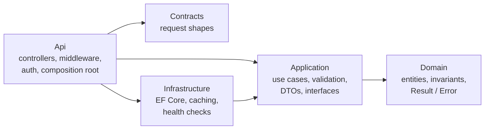

# TemplateApp

ASP.NET Core 10 Web API template extracted from the MechanicShop workshop system. It keeps that project's architecture and development flow:
- Clean Architecture layers;
- feature folders with one use case per command or query (MediatR);
- `Result<T>` errors mapped to problem details by an `ApiController` base class;
- versioned controllers;
- a Contracts project for request shapes.

It adds the operational pieces a new service needs: caching (HybridCache with optional Redis), Serilog and Seq, Docker, automated deployment, and tests at every layer.

A small **TodoItems** feature shows the full flow and is designed to be deleted. A new project starts by defining its own entities, database configuration and use cases. The infrastructure is already in place.

The repository is also a `dotnet new` template (`cleanarch-api`).

---

## Contents

- [Rules for developers and AI agents](#rules-for-developers-and-ai-agents)
- [Architecture](#architecture)
- [Folder structure](#folder-structure)
- [Getting started](#getting-started)
- [Running with Docker](#running-with-docker)
- [Configuration and optional services](#configuration-and-optional-services)
- [Database migrations](#database-migrations)
- [Authentication](#authentication)
- [Errors and the Result pattern](#errors-and-the-result-pattern)
- [Caching](#caching)
- [Logging, tracing and health checks](#logging-tracing-and-health-checks)
- [Testing](#testing)
- [CI/CD](#cicd)
- [Using the dotnet template](#using-the-dotnet-template)
- [Adding a feature](#adding-a-feature)
- [Removing the sample feature](#removing-the-sample-feature)
- [Design decisions and known limitations](#design-decisions-and-known-limitations)
- [Relationship to the original project](#relationship-to-the-original-project)

---

## Rules for developers and AI agents

The conventions are written down and enforced:

- [RULES-COMPOSE.md](RULES-COMPOSE.md) is the index. It says which rule files apply to which paths and what enforces each rule.
- [RULES.md](RULES.md) holds the solution-wide rules: architecture, workflow, clean code, coupling, performance, security, definition of done.
- Each project has its own rule file:
  - [Domain](src/TemplateApp.Domain/RULES.md)
  - [Application](src/TemplateApp.Application/RULES.md)
  - [Contracts](src/TemplateApp.Contracts/RULES.md)
  - [Infrastructure](src/TemplateApp.Infrastructure/RULES.md)
  - [Api](src/TemplateApp.Api/RULES.md)
  - [tests](tests/RULES.md)
- [CLAUDE.md](CLAUDE.md) and [AGENTS.md](AGENTS.md) point coding agents to the index.

All of these files are included in generated projects, with names replaced.

## Architecture



| Layer | Owns | May reference |
|---|---|---|
| **Domain** | Entities, invariants, `<Entity>Errors`, `Result<T>`/`Error` | nothing |
| **Application** | `Features/<Feature>/{Commands,Queries}/<UseCase>`, `Dtos`, `Mappers`, pipeline behaviours, the interfaces it needs | Domain, MediatR, FluentValidation, EF Core abstractions |
| **Contracts** | HTTP request shapes (`Requests/<Feature>`, `Common/PageRequest`) | nothing |
| **Infrastructure** | `Data/` (AppDbContext, configurations, interceptors, migrations, initialiser), `Caching/`, `Settings/` | Application, Domain |
| **Api** | `Controllers/` (deriving from `ApiController`), `Infrastructure/` middleware, OpenAPI, auth, `DependencyInjection` | Application, Contracts, Infrastructure (registration only) |

What the architecture tests enforce (`tests/TemplateApp.ArchitectureTests`):

- **Dependencies point inwards.** Domain and Contracts depend on nothing. Application does not depend on Infrastructure, Api or Contracts. Infrastructure does not depend on Api or ASP.NET Core.
- **Controllers stay thin.** They never touch `IAppDbContext`, EF Core or Infrastructure.
- **Requests live in their use-case folder.** Each request sits in `Features/<Feature>/{Commands|Queries}/<UseCase>` and has exactly one sealed `<Request>Handler` beside it. Validators are sealed, named `<Request>Validator` and placed beside their request.
- **Feature subfolders and cache interfaces are used correctly.** DTOs are in `Dtos/` and mappers in `Mappers/`. `ICachedQuery` is only on queries and `IInvalidatesCache` only on commands.
- **Shapes of controllers and entities.** Controllers are sealed and derive from `ApiController`. Domain entities have no public setters.

### Request flow

```
HTTP → RequestLogContextMiddleware (correlation id) → Serilog request logging → exception handler → authentication/authorization
     → TodoItemsController (maps Contracts request → command/query) → ISender
         → PerformanceBehaviour → ValidationBehaviour → CacheInvalidationBehaviour → handler
     ← Result<T> → result.Match(Ok/CreatedAtRoute/NoContent, ApiController.Problem) → 2xx or problem details
```

## Folder structure

```
.
├── .github/workflows/                 ci.yml, release.yml, deploy.yml
├── .template.config/                  dotnet new template definition
├── deploy/                            docker-compose.prod.yml, deploy.sh, rollback.sh, server.env.example
├── src/
│   ├── Directory.Build.props          adds the banned-API analyzer to production code
│   ├── BannedSymbols.txt
│   ├── TemplateApp.Domain/
│   │   ├── Common/                    Entity, AuditableEntity, Results/ (Result, Error, ErrorKind, Abstractions/)
│   │   └── TodoItems/                 TodoItem, TodoItemErrors                                  ← sample
│   ├── TemplateApp.Application/
│   │   ├── Common/
│   │   │   ├── Behaviours/            PerformanceBehaviour, ValidationBehaviour, CacheInvalidationBehaviour
│   │   │   ├── Exceptions/            UniqueConstraintViolationException
│   │   │   ├── Interfaces/            IAppDbContext, ICacheService, ICachedQuery, IInvalidatesCache, ICommand, IQuery, IUser
│   │   │   └── Models/                PaginatedList<T>
│   │   ├── Features/TodoItems/                                                                   ← sample
│   │   │   ├── Commands/              CreateTodoItem/, UpdateTodoItem/, DeleteTodoItem/  (command + handler + validator)
│   │   │   ├── Queries/               GetTodoItemById/, GetTodoItems/                    (query + handler + validator)
│   │   │   ├── Dtos/                  TodoItemDto
│   │   │   ├── Mappers/               TodoItemMapper (Projection + ToDto)
│   │   │   └── TodoItemCache.cs       cache tag and lifetime
│   │   └── DependencyInjection.cs     AddApplication()
│   ├── TemplateApp.Contracts/
│   │   ├── Common/                    PageRequest
│   │   └── Requests/TodoItems/        CreateTodoItemRequest, UpdateTodoItemRequest            ← sample
│   ├── TemplateApp.Infrastructure/
│   │   ├── Caching/                   HybridCacheService, RedisCacheTagIndex, RedisHealthCheck
│   │   ├── Data/                      AppDbContext, ApplicationDbContextInitialiser, Configurations/, Interceptors/, Migrations/
│   │   ├── Settings/                  CachingOptions, DatabaseOptions
│   │   └── DependencyInjection.cs     AddInfrastructure(configuration)
│   └── TemplateApp.Api/
│       ├── Controllers/               ApiController (error mapping), TodoItemsController       ← sample controller
│       ├── Extensions/                HealthCheckExtensions
│       ├── Infrastructure/            GlobalExceptionHandler, RequestLogContextMiddleware
│       ├── OpenApi/Transformers/      BearerSecuritySchemeTransformer
│       ├── Services/                  CurrentUser (IUser)
│       ├── DependencyInjection.cs     AddPresentation(), UseCoreMiddlewares()
│       └── IAssemblyMarker.cs, MigrationMode.cs, Program.cs
├── tests/
│   ├── TemplateApp.Domain.UnitTests/
│   ├── TemplateApp.Application.UnitTests/       Features/<Feature>/{Commands,Queries}/<UseCase>/, Behaviours/, Common/
│   ├── TemplateApp.Infrastructure.IntegrationTests/  Data/, Caching/, Common/
│   ├── TemplateApp.Api.IntegrationTests/        Controllers/, Infrastructure/, Common/
│   ├── TemplateApp.ArchitectureTests/
│   └── TemplateApp.Tests.Common/                test data factories (TodoItemFactory)
├── RULES-COMPOSE.md, RULES.md, CLAUDE.md, AGENTS.md
├── Directory.Build.props              net10.0, nullable, warnings as errors, StyleCop
├── Directory.Packages.props           central package management (all versions in one place)
├── docker-compose.yml, Dockerfile, .env.example
└── dotnet-tools.json                  dotnet-ef
```

## Getting started

Prerequisites: .NET SDK 10.0.100 or later. Docker for the local database and the integration tests.

```bash
# 1. Dependencies (SQL Server; Redis and Seq are optional)
cp .env.example .env          # set DB_SA_PASSWORD and JWT_SIGNING_KEY
docker compose up -d db redis seq

# 2. Connection strings (user secrets, never appsettings)
dotnet user-secrets set "ConnectionStrings:Database" "Server=localhost,1433;Database=TemplateApp;User Id=sa;Password=<DB_SA_PASSWORD>;Encrypt=True;TrustServerCertificate=True" --project src/TemplateApp.Api
dotnet user-secrets set "ConnectionStrings:Redis" "localhost:6379" --project src/TemplateApp.Api

# 3. A development token (also writes the token validation settings for Development)
dotnet user-jwts create --project src/TemplateApp.Api --output token

# 4. Run. In Development the database is migrated and seeded on startup (Database:* settings).
dotnet run --project src/TemplateApp.Api --launch-profile http
```

- API: `http://localhost:5080/api/v1/todo-items`
- API reference (Scalar, when `OpenApi:Enabled`): `http://localhost:5080/scalar`
- OpenAPI document: `http://localhost:5080/openapi/v1.json`
- Seq: `http://localhost:8081`

```bash
curl -H "Authorization: Bearer <token>" -H "Content-Type: application/json" \
     -d '{"title":"First task"}' http://localhost:5080/api/v1/todo-items
```

## Running with Docker

```bash
cp .env.example .env            # set DB_SA_PASSWORD and JWT_SIGNING_KEY
docker compose up --build -d
docker compose ps               # api becomes "healthy" after the migrator has finished
docker compose logs -f api
docker compose down             # add -v to delete the database and Seq volumes
```

| Service | Purpose | Enabled by | Port (host) | Health check | Data |
|---|---|---|---|---|---|
| `api` | The API | always | `API_PORT` (8080) | `GET /health/ready` | — |
| `migrator` | Same image, runs `--migrate` once; `api` waits for it to succeed | always | — | exit code | — |
| `db` | SQL Server 2022 (Developer edition) | always | `DB_PORT` (1433) | `sqlcmd SELECT 1` | `db-data` volume |
| `redis` | Shared cache tier, no persistence | `COMPOSE_PROFILES` contains `cache` | `REDIS_PORT` (6379) | `redis-cli ping` | none |
| `seq` | Log server (UI on 8081, ingestion on 5341) | `COMPOSE_PROFILES` contains `logging` | 8081, 5341 | — | `seq-data` volume |

The image is a multi-stage build. The SDK image restores (cached on project files) and publishes. The result runs on `aspnet:10.0` as the non-root `app` user on port 8080. The container health check uses bash's `/dev/tcp` because the runtime image has no `curl`.

For a token against the Docker stack, use the issuer and audience from `.env`:

```bash
dotnet user-jwts create --project src/TemplateApp.Api --issuer templateapp-local --audience templateapp-api --output token
dotnet user-jwts key --project src/TemplateApp.Api --issuer templateapp-local      # put this key in JWT_SIGNING_KEY
```

> SQL Server images are amd64 only. On Apple silicon, enable Rosetta emulation in Docker Desktop.

## Configuration and optional services

Normal ASP.NET Core precedence applies: `appsettings.json` → `appsettings.{Environment}.json` → user secrets (Development) → environment variables. In environment variables, `:` becomes `__`.

| Setting | Default (Production / Development) | Purpose |
|---|---|---|
| `ConnectionStrings:Database` | — | **Required.** The API refuses to start without it. |
| `ConnectionStrings:Redis` | empty | **Optional Redis.** Empty means in-process cache only. Requires Redis 7.0+. |
| `OpenApi:Enabled` | `false` / `true` | **Optional OpenAPI.** Serves `/openapi/v1.json` and the Scalar UI at `/scalar`. |
| `Database:InitializeOnStartup` | `false` / `true` | Applies migrations at startup. Deployments use `--migrate` instead. |
| `Database:SeedSampleData` | `false` / `true` | Inserts the sample todo items into an empty database. |
| `Serilog:WriteTo:Seq:Args:serverUrl` | — / `http://localhost:5341` | **Optional Seq sink.** Add `Serilog__WriteTo__Seq__Name=Seq` to enable it outside Development. Console logging is always on. |
| `Caching:LocalExpiration` | `00:00:30` | In-process tier lifetime, and the bound on cross-instance staleness. |
| `Caching:RedisInstanceName` | `templateapp:` | Prefix for every Redis key. |
| `Authentication:Schemes:Bearer:*` | — | Token validation (see [Authentication](#authentication)). Always set `ValidAudiences`. |

The Docker `.env` switches (see `.env.example`):

| Variable | Effect |
|---|---|
| `COMPOSE_PROFILES=cache,logging` | Starts Redis and Seq. Remove a profile to skip that container. |
| `REDIS_CONNECTION_STRING` | Passed to the API as `ConnectionStrings__Redis`. Leave empty to disable Redis in the app. |
| `SEQ_SERVER_URL` | Seq endpoint for the API and migrator. |
| `ASPNETCORE_ENVIRONMENT` | `Development` (default here) enables OpenAPI and database seeding. |

On a deployment server, the same switches live in `deploy/server.env.example`: `COMPOSE_PROFILES=cache` plus `ConnectionStrings__Redis`, and the optional `Serilog__WriteTo__Seq__*`.

## Database migrations

Migrations live in `src/TemplateApp.Infrastructure/Data/Migrations`. The `dotnet-ef` tool is pinned in `dotnet-tools.json`.

```bash
dotnet tool restore
dotnet ef migrations add <Name> --project src/TemplateApp.Infrastructure --startup-project src/TemplateApp.Api --output-dir Data/Migrations
dotnet ef migrations script --idempotent --project src/TemplateApp.Infrastructure --startup-project src/TemplateApp.Api -o migrate.sql
dotnet run --project src/TemplateApp.Api -- --migrate          # apply pending migrations and exit
```

There are two ways migrations get applied:

- **Development:** `ApplicationDbContextInitialiser` migrates, and optionally seeds, when the API starts. This is the original project's workflow, switched by `Database:*`.
- **Docker and deployments:** the same binary in `--migrate` mode. Docker Compose runs the `migrator` service before `api`, and `deploy/deploy.sh` runs it before switching versions. A failed migration stops the deployment and leaves the running version untouched.

`Migrations_MatchTheCurrentModel` fails when the model changes without a migration. Keep migrations backward compatible (expand, then contract), because rollbacks never revert the schema.

## Authentication

Controllers are `[Authorize]`. Health endpoints are anonymous. Validation is configured entirely from `Authentication:Schemes:Bearer`:

- **Production:** `Authority` (your OpenID Connect provider) and `ValidAudiences`.
- **Local `dotnet run`:** `dotnet user-jwts create` writes the issuer and audiences to `appsettings.Development.json` and the key to user secrets.
- **Docker / self-issued tokens:** `ValidIssuer`, `ValidAudiences` and `SigningKeys` (see `.env.example`).

The API validates tokens and never issues them. `IUser.Id` exposes the `sub` claim, which the audit interceptor stores in `CreatedBy` and `LastModifiedBy`.

## Errors and the Result pattern

Handlers never throw for expected outcomes. They return `Result<T>`: a value, or a list of `Error(Code, Description, Kind)`. Controllers map it with `result.Match(response => Ok(response), Problem)`. `ApiController.Problem` is the only error-to-HTTP mapping:

| `ErrorKind` | HTTP | Body |
|---|---|---|
| `Validation` | 400 | `ValidationProblemDetails`, field errors grouped by `Code` |
| `Unauthorized` / `Forbidden` | 401 / 403 | ProblemDetails with `code` |
| `NotFound` | 404 | ProblemDetails with `code` |
| `Conflict` | 409 | ProblemDetails with `code` |
| `Failure` | 422 | ProblemDetails with `code` |
| `Unexpected` | 500 | ProblemDetails with `code` |

Every problem response carries `traceId`, `correlationId` and `instance`.

`GlobalExceptionHandler` logs unexpected exceptions with full detail and returns a generic 500 with no exception type or message (asserted by a test). `Result<T>.Value` throws on a failed result, so a missing `IsError` check fails loudly.

## Caching

```
query handler → ICacheService (Application)  → HybridCacheService (Infrastructure)
                                                 → L1: in-process memory, per instance
                                                 → L2: Redis, shared (when ConnectionStrings:Redis is set)
```

**Reading.** As in the original project, the query declares its cache key, tags and lifetime by implementing `ICachedQuery<T>`:

```csharp
public sealed record GetTodoItemByIdQuery(Guid TodoItemId) : ICachedQuery<TodoItemDto>
{
    public string CacheKey => $"todo-item:{TodoItemId:N}";
    public string[] Tags => [TodoItemCache.Tag];
    public TimeSpan Expiration => TodoItemCache.Expiration;
}
```

The handler reads through the cache:

```csharp
var todoItem = await cache.GetOrCreateAsync(query, async token => await context.TodoItems
    .AsNoTracking().Where(item => item.Id == query.TodoItemId)
    .Select(TodoItemMapper.Projection).FirstOrDefaultAsync(token), ct);
```

Only DTOs are cached, never tracked entities. Concurrent misses for a key run the factory once. Keys must include every parameter, and the user or tenant id for user-scoped data.

**Invalidating.** A command declares the tags it makes stale:

```csharp
public sealed record UpdateTodoItemCommand(...) : ICommand<TodoItemDto>, IInvalidatesCache
{
    public string[] CacheTags => [TodoItemCache.Tag];
}
```

`CacheInvalidationBehaviour` removes those tags after the handler succeeds, even if the request was cancelled after the commit. Handlers never invalidate by hand.

**Across instances.** HybridCache's `RemoveByTagAsync` is per process: in a two-instance test, the second instance kept serving the old value from Redis. `RedisCacheTagIndex` therefore tracks each tag's keys in Redis and deletes them on invalidation. Another instance can then be stale for at most `Caching:LocalExpiration` (30 s). `RedisCacheTests` verifies this.

**When Redis is unavailable** the cache fails open:
- reads return uncached data;
- invalidation failures are logged as warnings;
- `/health/ready` reports `redis: Degraded` but still returns 200.

Keep Redis timeouts short (see `.env.example`).

## Logging, tracing and health checks

- **Serilog** is configured from `Serilog:*`. Sinks are named objects (`WriteTo:Console`, `WriteTo:Seq`), so environment variables can add or override them.
- **Request logging:** one event per request with method, path (no query string), status, elapsed time and `UserId`. 5xx responses log at Error; `/health/*` logs at Verbose.
- **Correlation:** `RequestLogContextMiddleware` accepts a well-formed `X-Correlation-Id` or uses the W3C trace id. It echoes the id in the response and adds `CorrelationId` to every log event of the request.
- **Sensitive data:** bodies, query strings and headers are not logged, and handlers log identifiers only.
- **Health:**
  - `/health/live` checks only that the process is running;
  - `/health/ready` checks the database (503 when down) and Redis (Degraded when down).

**Tracing a request in Seq** (`http://localhost:8081`):

```bash
curl -H "X-Correlation-Id: checkout-42" -H "Authorization: Bearer <token>" http://localhost:8080/api/v1/todo-items
```

Then search `CorrelationId = 'checkout-42'` in Seq. Without the header, use the `correlationId` or `traceId` from the response: `CorrelationId = '<id>'` or `@TraceId = '<id>'`.

## Testing

```bash
dotnet test                                             # everything (Docker must be running)
dotnet test tests/TemplateApp.ArchitectureTests         # boundaries and conventions, no Docker
dotnet test tests/TemplateApp.Domain.UnitTests          # no Docker
dotnet test tests/TemplateApp.Application.UnitTests     # no Docker
```

| Project | What it proves | Dependencies |
|---|---|---|
| `Domain.UnitTests` (16) | Entity invariants and transitions, `Result<T>` semantics | none |
| `Application.UnitTests` (28) | Per use case: handler outcomes (success, not found, conflict, race on the unique index), validators, cache keys. Pipeline: validation short-circuits, invalidation only on success, read-after-write | EF Core InMemory |
| `Infrastructure.IntegrationTests` (14) | Migrations match the model; audit stamping; unique index → conflict; SQL ordering; cache hit, miss and invalidation; unreachable Redis; cross-instance invalidation | Testcontainers: SQL Server, Redis |
| `Api.IntegrationTests` (19) | Routes, status codes, problem bodies, Location header, auth, health, correlation, 500 without leaked details, cache invalidation end to end | Testcontainers: SQL Server |
| `ArchitectureTests` (21) | Layer dependencies and folder/naming conventions | none |

`Tests.Common` holds the test data factories (`TodoItemFactory`) shared by all projects. Test placement and naming rules: [tests/RULES.md](tests/RULES.md).

## CI/CD

| Workflow | Trigger | Does |
|---|---|---|
| `ci.yml` | pull requests, pushes to branches other than `main`, called by `release.yml` | restore; build (warnings are errors, analyzers on); **architecture tests first**; full test suite with Testcontainers; upload TRX and coverage; Docker build without push |
| `release.yml` | push to `main` | `ci` → **publish** `REGISTRY/IMAGE_NAME:sha-<commit>` and `:latest` → **deploy** (only when `DEPLOY_ENABLED` is `true`) |
| `deploy.yml` | called by `release.yml`, or **Run workflow** by hand | deploys any existing tag over SSH; also the rollback path |

Publishing needs `ci` to succeed, and deploying needs publishing to succeed. The deploy job runs in the GitHub environment `production`, so its protection rules gate it.

### What the deploy does

1. Copies `deploy/docker-compose.prod.yml`, `deploy.sh` and `rollback.sh` to `DEPLOY_PATH` on the server.
2. Logs the server in to the registry. The token is passed on stdin.
3. Runs `deploy.sh <image>`:
   1. pull the image;
   2. run the migrator (on failure, the old version keeps serving);
   3. recreate `api`;
   4. wait up to 150 s for health;
   5. if the new version is unhealthy, roll back to the previous image and fail the job.
4. Probes `PUBLIC_URL/health/ready` when set.

### Required configuration

Repository **variables**:

| Variable | Required | Example |
|---|---|---|
| `DEPLOY_ENABLED` | yes | `true` |
| `DEPLOY_PATH` | yes | `/opt/templateapp` |
| `DEPLOY_PORT` | no | `22` |
| `REGISTRY` | no | `ghcr.io` (default) |
| `IMAGE_NAME` | no | `owner/repo` (default) |
| `PUBLIC_URL` | no | `https://api.example.com` |

**Secrets** (on the `production` environment):

| Secret | Required | Purpose |
|---|---|---|
| `DEPLOY_HOST`, `DEPLOY_USER` | yes | SSH target |
| `DEPLOY_SSH_KEY` | yes | Deploy-only private key |
| `DEPLOY_KNOWN_HOSTS` | yes | `ssh-keyscan -p <port> <host>` output (pinned host keys) |
| `REGISTRY_PULL_USERNAME`, `REGISTRY_PULL_TOKEN` | yes | Read-only registry credentials for the server |
| `REGISTRY_USERNAME`, `REGISTRY_PASSWORD` | non-GHCR only | Push credentials (GHCR uses `GITHUB_TOKEN`) |

**On the server** (once):
1. Install Docker with the Compose plugin.
2. Create `DEPLOY_PATH/.env` from `deploy/server.env.example` with `chmod 600`.
3. Put a TLS reverse proxy in front of `127.0.0.1:8080`.

The production compose file expects an external SQL Server. Redis runs locally when `COMPOSE_PROFILES=cache`.

### Rollback

- **GitHub:** Actions → **Deploy** → Run workflow with `image-tag` = a previous `sha-<commit>`.
- **Server:** `cd $DEPLOY_PATH && ./rollback.sh` (previous image) or `./rollback.sh <image>`.
- **Automatic:** `deploy.sh` restores the previous image when the new one never becomes healthy.

Database migrations are never reverted.

## Using the dotnet template

```bash
dotnet new install ./CleanArchitecture.Template        # from the folder that contains it
dotnet new cleanarch-api -n Acme.Orders -o Acme.Orders
cd Acme.Orders
dotnet build
dotnet test
dotnet new uninstall                                    # lists installed templates and the exact uninstall command
```

`-n` drives every name:

- **Projects, namespaces, assemblies, solution, folders and rule-file paths:** the namespace-safe form of the name with its first letter upper-cased (`Contoso.Orders`; `acme-billing` → `Acme_billing`).
- **Docker image, Redis prefix and default token issuer/audience:** a lowercase slug (`contoso-orders`).
- **UserSecretsId:** a fresh GUID.

Use a PascalCase name such as `Acme.Orders`. On Windows, generate into a short path: deep paths exceed the 260-character limit (`MSB3030`).

Generated projects exclude build output, IDE folders, `.git`, `.env` files (except `.env.example`), private keys, local databases and backups.

## Adding a feature

Example: a `Projects` feature with a `CreateProject` use case. This follows [RULES.md § 2](RULES.md#2-development-workflow-one-use-case-at-a-time).

**1. Domain:** `src/TemplateApp.Domain/Projects/Project.cs` (derive from `AuditableEntity`, private setters, `static Result<Project> Create(...)`) and `ProjectErrors.cs`, which holds validation, not-found and conflict errors.

**2. Persistence:**
- add `DbSet<Project> Projects { get; }` to `Application/Common/Interfaces/IAppDbContext.cs`;
- add `public DbSet<Project> Projects => Set<Project>();` to `Infrastructure/Data/AppDbContext.cs`;
- add `Infrastructure/Data/Configurations/ProjectConfiguration.cs`;
- create the migration:

```bash
dotnet ef migrations add AddProjects --project src/TemplateApp.Infrastructure --startup-project src/TemplateApp.Api --output-dir Data/Migrations
```

**3. Use case:** `src/TemplateApp.Application/Features/Projects/`

```
Commands/CreateProject/CreateProjectCommand.cs            sealed record : ICommand<ProjectDto>, IInvalidatesCache
Commands/CreateProject/CreateProjectCommandHandler.cs     sealed : ICommandHandler<CreateProjectCommand, ProjectDto>
Commands/CreateProject/CreateProjectCommandValidator.cs   sealed : AbstractValidator<CreateProjectCommand>
Queries/GetProjects/GetProjectsQuery.cs                   sealed record : ICachedQuery<PaginatedList<ProjectDto>>
Dtos/ProjectDto.cs
Mappers/ProjectMapper.cs                                  Projection expression + ToDto()
ProjectCache.cs                                           Tag + Expiration
```

```csharp
public sealed class CreateProjectCommandHandler(IAppDbContext context)
    : ICommandHandler<CreateProjectCommand, ProjectDto>
{
    public async Task<Result<ProjectDto>> Handle(CreateProjectCommand command, CancellationToken ct)
    {
        var createResult = Project.Create(command.Name);
        if (createResult.IsError)
        {
            return Result.Failure<ProjectDto>(createResult.Errors);
        }

        context.Projects.Add(createResult.Value);
        await context.SaveChangesAsync(ct);
        return createResult.Value.ToDto();
    }
}
```

**4. Contracts:** `src/TemplateApp.Contracts/Requests/Projects/CreateProjectRequest.cs`.

**5. Controller:** `src/TemplateApp.Api/Controllers/ProjectsController.cs`

```csharp
[Route("api/v{version:apiVersion}/projects")]
[ApiVersion("1.0")]
[Authorize]
public sealed class ProjectsController(ISender sender) : ApiController
{
    [HttpPost]
    [ProducesResponseType(typeof(ProjectDto), StatusCodes.Status201Created)]
    [ProducesResponseType(typeof(ValidationProblemDetails), StatusCodes.Status400BadRequest)]
    [EndpointName("CreateProject")]
    [MapToApiVersion("1.0")]
    public async Task<IActionResult> Create([FromBody] CreateProjectRequest request, CancellationToken ct)
    {
        var result = await sender.Send(new CreateProjectCommand(request.Name), ct);
        return result.Match(response => Ok(response), Problem);
    }
}
```

**6. Tests:**
- `Domain.UnitTests/Projects/`
- `Application.UnitTests/Features/Projects/Commands/CreateProject/`
- `Api.IntegrationTests/Controllers/ProjectsControllerTests.cs`
- a `ProjectFactory` in `Tests.Common/Projects/`

**7. Verify:**

```bash
dotnet build
dotnet test tests/TemplateApp.ArchitectureTests
dotnet test
```

Registration is automatic: handlers, validators, controllers and EF configurations are discovered by assembly scanning.

## Removing the sample feature

Add your first feature before or together with removing TodoItems. The architecture tests intentionally fail when there are no requests, validators or controllers to check.

1. Delete:
   - `src/TemplateApp.Domain/TodoItems/`
   - `src/TemplateApp.Application/Features/TodoItems/`
   - `src/TemplateApp.Contracts/Requests/TodoItems/`
   - `src/TemplateApp.Api/Controllers/TodoItemsController.cs`
   - `src/TemplateApp.Infrastructure/Data/Configurations/TodoItemConfiguration.cs`
   - `src/TemplateApp.Infrastructure/Data/Migrations/`
2. Remove `TodoItems` from `IAppDbContext` and `AppDbContext`, and replace or delete the sample rows in `ApplicationDbContextInitialiser.SeedAsync`.
3. Delete the sample tests:
   - `tests/TemplateApp.Domain.UnitTests/TodoItems/`
   - `tests/TemplateApp.Application.UnitTests/Features/TodoItems/`
   - `tests/TemplateApp.Api.IntegrationTests/Controllers/TodoItemsControllerTests.cs`
   - `tests/TemplateApp.Tests.Common/TodoItems/`
   - the TodoItem-specific tests in `Infrastructure.IntegrationTests/Data/PersistenceTests.cs` (keep `Migrations_MatchTheCurrentModel`)

   Then point `PipelineTests`, `InMemoryAppDbContext` and `PlatformTests` (which call `/api/v1/todo-items`) at your own feature.
4. Create a fresh initial migration with `dotnet ef migrations add InitialCreate …`.

## Design decisions and known limitations

- **Persistence follows the original.** Handlers use `IAppDbContext` (EF Core `DbSet`s) directly, with no repository layer. Application therefore references `Microsoft.EntityFrameworkCore` (not a provider), and handler unit tests use the InMemory provider. SQL-specific behaviour is tested only against SQL Server.
- **Controllers, not minimal APIs.** The original project's minimal-API endpoint files were never mapped; the controllers were the working transport, so the template keeps controllers.
- **MediatR is pinned to 12.5.0**, the last Apache-2.0 release. Version 13 and later need a commercial license.
- **No domain events.** The original dispatched them through MediatR before `SaveChanges`, which also made the Domain depend on MediatR. If you need them, raise them without a MediatR dependency and dispatch them after commit, ideally through an outbox.
- **Cache consistency is eventual:**
  - other instances can be stale for up to `Caching:LocalExpiration`;
  - an invalidation made while Redis is down leaves entries until they expire (5 minutes for the sample);
  - the usual cache-aside race can store an old value until it expires.
- **Without Seq, the Seq sink drops events after its retries;** console logging continues. Remove `Serilog__WriteTo__Seq__*` to turn the sink off entirely.
- **Uniqueness follows the database collation,** which is case-insensitive by default.
- **No TLS, CORS or rate limiting in the app.** TLS terminates at the reverse proxy; add CORS and `AddRateLimiter` when needed.
- **Single-host deployment** with SSH and Docker Compose, with no zero-downtime rolling update.
- **Integration tests need Docker.**

## Relationship to the original project

| | |
|---|---|
| **Same as the original** | Layer projects including **Contracts**. `Features/<Feature>/{Commands,Queries}/<UseCase>` with `Dtos/` and `Mappers/`. `Common/{Behaviours,Interfaces,Models}`. `IAppDbContext` over EF Core. `<Entity>Errors` in Domain. `Result<T>`/`Error`/`ErrorKind`. Controllers deriving from `ApiController` with `Problem(errors)`. Asp.Versioning with `api/v{version}` routes. `ICachedQuery` keys declared on the query. `IUser`. `PaginatedList<T>`. `ApplicationDbContextInitialiser`. `Data/Configurations` and `Data/Interceptors`. `RequestLogContextMiddleware`. `AddPresentation`/`AddApplication`/`AddInfrastructure` and `UseCoreMiddlewares`. `IAssemblyMarker`. `Tests.Common` factories. Serilog + Seq. Central package management. StyleCop. |
| **Fixed** | Domain no longer depends on MediatR. `Result.Value` throws on failure. Validation passes the `CancellationToken` and avoids `dynamic`. `Unauthorized`/`Forbidden` map to 401/403. Repeated field errors no longer crash the mapping. The exception handler logs and never returns exception messages. The correlation middleware is registered. Invalidation runs only after success and works across instances. Request payloads are no longer logged. The container runs as non-root. CI runs on `main`. |
| **Added** | Commands and queries as markers (`ICommand`/`IQuery`). Fail-open cache with optional Redis. Health checks. `--migrate` mode. Compose profiles and `.env`. Image publishing and SSH deployment with rollback. Architecture tests. Banned-API analyzer. Rule files for developers and AI agents. `dotnet new` packaging. |
| **Removed** | All workshop business code (customers, vehicles, work orders, invoices, scheduling, labor), the Blazor client, SignalR, PDF generation, the identity user store and token issuing, the overdue-booking background job, OpenTelemetry/Prometheus/Grafana, output caching, the unused rate limiter and the unmapped minimal-API endpoints. |
