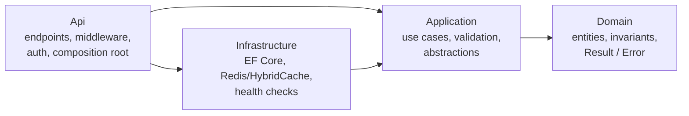

# TemplateApp

ASP.NET Core 10 Web API built on Clean Architecture with vertical slices. Each application operation is a self-contained use case (request, handler, validator) dispatched through MediatR. Expected failures travel as `Result<T>` values and become RFC 9457 problem responses in one place. Reads are cached with HybridCache, using Redis as an optional shared tier.

The repository is also a `dotnet new` template (`cleanarch-api`). A small **Todos** feature demonstrates every convention and is designed to be deleted.

---

## Contents

- [Architecture](#architecture)
- [Folder structure](#folder-structure)
- [Getting started](#getting-started)
- [Running with Docker](#running-with-docker)
- [Configuration](#configuration)
- [Database migrations](#database-migrations)
- [Authentication](#authentication)
- [Errors and the Result pattern](#errors-and-the-result-pattern)
- [Caching](#caching)
- [Logging, tracing and health checks](#logging-tracing-and-health-checks)
- [Testing](#testing)
- [CI/CD](#cicd)
- [Using the dotnet template](#using-the-dotnet-template)
- [Adding a feature](#adding-a-feature)
- [Removing the sample feature](#removing-the-sample-feature)
- [Design decisions and known limitations](#design-decisions-and-known-limitations)
- [Origin of this template](#origin-of-this-template)

---

## Architecture



| Layer | Owns | May reference |
|---|---|---|
| **Domain** | Entities, invariants, `Result<T>`, `Error` | Nothing (no packages, no projects) |
| **Application** | Use cases (commands, queries, handlers, validators), pipeline behaviours, abstractions it needs (`IAppDbContext`, `ICacheService`, `ICurrentUser`) | Domain, MediatR, FluentValidation, EF Core *abstractions* |
| **Infrastructure** | EF Core/SQL Server, migrations, audit interceptor, HybridCache/Redis, health checks | Application, Domain |
| **Api** | HTTP endpoints, request DTOs, error mapping, authentication, middleware, Serilog, composition root | Application; Infrastructure only for registration and `--migrate` |

The rules are enforced by `tests/TemplateApp.ArchitectureTests`:

- The Domain has no dependency on the other layers or on MediatR, FluentValidation, EF Core, ASP.NET Core or `Microsoft.Extensions.*`.
- Application has no dependency on Infrastructure, Api, ASP.NET Core, the SQL Server provider, Redis, HybridCache or Serilog.
- Infrastructure does not depend on Api or ASP.NET Core.
- Endpoints never touch `IAppDbContext`, EF Core or Infrastructure. They can only reach data through a use case.
- Every request implements exactly one of `ICommand<T>` or `IQuery<T>`, and its name ends in `Command` or `Query`.
- Every request has exactly one sealed handler named `<Request>Handler`, in the same namespace (folder) as the request.
- Validators are sealed and live next to the request they validate.
- Domain entities expose no public setters.

### Request flow

```
HTTP → CorrelationIdMiddleware → Serilog request logging → exception handler → authentication/authorization
     → endpoint (maps body to a command) → MediatR
         → PerformanceBehaviour → ValidationBehaviour → CacheInvalidationBehaviour → handler
     ← Result<T> → ResultHttpExtensions.ToHttpResult → 2xx or ProblemDetails
```

## Folder structure

```
.
├── .github/workflows/          ci.yml, release.yml, deploy.yml
├── .template.config/           dotnet new template definition
├── deploy/                     production compose file, deploy.sh, rollback.sh, server.env.example
├── src/
│   ├── TemplateApp.Domain/
│   │   ├── Common/             Entity, AuditableEntity, Results/ (Result<T>, Error, ErrorKind)
│   │   └── Todos/              TodoItem, TodoItemErrors                      ← sample
│   ├── TemplateApp.Application/
│   │   ├── Common/
│   │   │   ├── Behaviours/     Performance, Validation, CacheInvalidation
│   │   │   ├── Caching/        ICacheService, CacheEntrySettings, IInvalidatesCache
│   │   │   ├── Data/           IAppDbContext, UniqueConstraintViolationException
│   │   │   ├── Identity/       ICurrentUser
│   │   │   ├── Messaging/      ICommand, IQuery and their handler interfaces
│   │   │   └── Models/         PagedResult<T>
│   │   └── Features/Todos/                                                   ← sample
│   │       ├── CreateTodo/     CreateTodoCommand, …Handler, …Validator
│   │       ├── GetTodoById/    GetTodoByIdQuery, …Handler
│   │       ├── ListTodos/      ListTodosQuery, …Handler, …Validator
│   │       ├── UpdateTodo/     UpdateTodoCommand, …Handler, …Validator
│   │       ├── DeleteTodo/     DeleteTodoCommand, …Handler
│   │       └── TodoCache.cs, TodoErrors.cs, TodoItemResponse.cs
│   ├── TemplateApp.Infrastructure/
│   │   ├── Caching/            HybridCacheService, RedisCacheTagIndex, RedisHealthCheck, CachingOptions
│   │   └── Persistence/        AppDbContext, Configurations/, Interceptors/, Migrations/, DatabaseMigrator
│   └── TemplateApp.Api/
│       ├── Endpoints/Todos/    TodoEndpoints, request bodies                 ← sample
│       ├── Health/             /health/live and /health/ready
│       ├── Http/               ResultHttpExtensions, GlobalExceptionHandler, CorrelationIdMiddleware, CurrentUser
│       ├── OpenApi/            Bearer security scheme for the API reference UI
│       ├── DependencyInjection.cs, MigrationMode.cs, Program.cs
├── tests/
│   ├── TemplateApp.Domain.UnitTests/
│   ├── TemplateApp.Application.UnitTests/
│   ├── TemplateApp.Infrastructure.IntegrationTests/
│   ├── TemplateApp.Api.IntegrationTests/
│   └── TemplateApp.ArchitectureTests/
├── Directory.Build.props       net10.0, nullable, warnings as errors, StyleCop
├── Directory.Packages.props    central package versions
├── docker-compose.yml          local stack
├── Dockerfile
├── dotnet-tools.json           dotnet-ef
└── .env.example
```

## Getting started

Prerequisites: .NET SDK 10.0.100 or later and Docker (for the database, and for the integration tests).

```bash
# 1. Start only the dependencies
cp .env.example .env          # then replace the <placeholders>
docker compose up -d db redis seq

# 2. Point the API at them (user secrets, never appsettings)
dotnet user-secrets set "ConnectionStrings:Database" "Server=localhost,1433;Database=TemplateApp;User Id=sa;Password=<DB_SA_PASSWORD>;Encrypt=True;TrustServerCertificate=True" --project src/TemplateApp.Api
dotnet user-secrets set "ConnectionStrings:Redis" "localhost:6379" --project src/TemplateApp.Api

# 3. Create the schema
dotnet run --project src/TemplateApp.Api -- --migrate

# 4. Get a development token (also configures token validation for Development)
dotnet user-jwts create --project src/TemplateApp.Api --output token

# 5. Run
dotnet run --project src/TemplateApp.Api --launch-profile http
```

- API: `http://localhost:5080`
- API reference (Scalar, Development only): `http://localhost:5080/scalar`
- Seq: `http://localhost:8081`

```bash
curl -H "Authorization: Bearer <token>" -H "Content-Type: application/json" \
     -d '{"title":"First task"}' http://localhost:5080/api/v1/todos
```

Redis is optional. Without `ConnectionStrings:Redis` the API uses the in-process cache only.

## Running with Docker

```bash
cp .env.example .env            # set DB_SA_PASSWORD and JWT_SIGNING_KEY
docker compose up --build -d
docker compose ps               # api becomes "healthy" after the migrator has finished
docker compose logs -f api
docker compose down             # add -v to delete the database and Seq volumes
```

| Service | Purpose | Port (host) | Health check | Data |
|---|---|---|---|---|
| `api` | The API (`ASPNETCORE_ENVIRONMENT` from `.env`, Development by default) | `API_PORT` (8080) | `GET /health/ready` | — |
| `migrator` | Same image, runs `--migrate` once and exits; `api` waits for it to succeed | — | exit code | — |
| `db` | SQL Server 2022 (Developer edition) | `DB_PORT` (1433) | `sqlcmd SELECT 1` | `db-data` volume |
| `redis` | Shared cache tier, no persistence | `REDIS_PORT` (6379) | `redis-cli ping` | none (cache) |
| `seq` | Log server, UI on `SEQ_UI_PORT` (8081), ingestion on `SEQ_INGESTION_PORT` (5341) | 8081, 5341 | — | `seq-data` volume |

The image is a multi-stage build: the SDK image restores (cached on project files) and publishes, then the result runs on `aspnet:10.0` as the non-root `app` user on port 8080. The runtime image has no `curl`, so the container health check uses bash's `/dev/tcp`.

To get a token for the Docker stack, let `dotnet user-jwts` create both the token and the key, using the issuer and audience from `.env`:

```bash
dotnet user-jwts create --project src/TemplateApp.Api --issuer templateapp-local --audience templateapp-api --output token
dotnet user-jwts key --project src/TemplateApp.Api --issuer templateapp-local   # copy the key into JWT_SIGNING_KEY
```

Any HS256 JWT with `iss = JWT_ISSUER`, `aud = JWT_AUDIENCE`, a `sub` claim and an `exp`, signed with the base64 key in `JWT_SIGNING_KEY`, works the same way.

> SQL Server images are amd64 only. On Apple silicon, enable Rosetta emulation in Docker Desktop.

## Configuration

Settings follow normal ASP.NET Core precedence: `appsettings.json` → `appsettings.{Environment}.json` → user secrets (Development) → environment variables. In environment variables, `:` becomes `__`.

| Setting | Environment variable | Default | Notes |
|---|---|---|---|
| `ConnectionStrings:Database` | `ConnectionStrings__Database` | — | **Required.** The API refuses to start without it. |
| `ConnectionStrings:Redis` | `ConnectionStrings__Redis` | — | Optional. StackExchange.Redis format; `abortConnect=false` is forced. Keep `connectTimeout`/`syncTimeout`/`asyncTimeout` low (see `docker-compose.yml`). Redis 7.0+ is required. |
| `Caching:LocalExpiration` | `Caching__LocalExpiration` | `00:00:30` | Upper bound for the in-process tier, and for cross-instance staleness. |
| `Caching:RedisInstanceName` | `Caching__RedisInstanceName` | `templateapp:` | Prefix for every Redis key. |
| `Authentication:Schemes:Bearer:Authority` | `Authentication__Schemes__Bearer__Authority` | — | OIDC issuer URL (production). |
| `Authentication:Schemes:Bearer:ValidAudiences:0` | `Authentication__Schemes__Bearer__ValidAudiences__0` | — | Always set this, so tokens issued for other APIs are rejected. |
| `Authentication:Schemes:Bearer:ValidIssuer` | `Authentication__Schemes__Bearer__ValidIssuer` | — | For self-issued tokens. |
| `Authentication:Schemes:Bearer:SigningKeys:0:Issuer` / `:Value` | `…__SigningKeys__0__Issuer` / `…__Value` | — | Base64 HMAC key for self-issued tokens. |
| `Serilog:MinimumLevel:Default` | `Serilog__MinimumLevel__Default` | `Information` | |
| `Serilog:WriteTo:Seq:Args:serverUrl` | `Serilog__WriteTo__Seq__Args__serverUrl` | `http://localhost:5341` in Development | Set `Serilog__WriteTo__Seq__Name=Seq` as well when enabling it outside Development. |
| `Serilog:WriteTo:Seq:Args:apiKey` | `Serilog__WriteTo__Seq__Args__apiKey` | — | For a secured Seq. |
| — | `ASPNETCORE_ENVIRONMENT` | `Production` | `Development` exposes `/openapi/v1.json` and `/scalar`. |
| — | `ASPNETCORE_HTTP_PORTS` | `8080` in the container | |

Sinks are configured as named objects (`WriteTo:Console`, `WriteTo:Seq`), so each one can be added or overridden from an environment variable without array indexes.

`.env` variables used by `docker-compose.yml`: `API_PORT`, `ASPNETCORE_ENVIRONMENT`, `DB_SA_PASSWORD` (required), `DB_NAME`, `DB_PORT`, `REDIS_PORT`, `SEQ_UI_PORT`, `SEQ_INGESTION_PORT`, `JWT_ISSUER`, `JWT_AUDIENCE`, `JWT_SIGNING_KEY` (required). `API_IMAGE` overrides the image tag.

## Database migrations

Migrations live in `src/TemplateApp.Infrastructure/Persistence/Migrations`. The `dotnet-ef` tool is pinned in `dotnet-tools.json`.

```bash
dotnet tool restore
dotnet ef migrations add <Name> --project src/TemplateApp.Infrastructure --startup-project src/TemplateApp.Api --output-dir Persistence/Migrations
dotnet ef migrations script --idempotent --project src/TemplateApp.Infrastructure --startup-project src/TemplateApp.Api -o migrate.sql
```

**Strategy:** the API never migrates during normal startup. The same binary has a migration mode that applies pending migrations and exits:

```bash
dotnet run --project src/TemplateApp.Api -- --migrate          # local
docker compose run --rm migrator                               # Docker
```

Docker Compose runs `migrator` before `api` starts, and `deploy/deploy.sh` runs it before switching versions. Schema changes therefore happen once per release, not in every replica. A migration failure stops the deployment and leaves the running version untouched. `Infrastructure.IntegrationTests` fails if the model has changes that no migration covers (`HasPendingModelChanges`).

Write migrations to be backward compatible (expand, then contract). Rollbacks redeploy older code but never revert the schema.

## Authentication

Endpoints under `/api` require a bearer token. Health endpoints are anonymous. Validation is configured entirely from `Authentication:Schemes:Bearer`, using the framework's built-in binding:

- **Production:** set `Authority` (your OpenID Connect provider) and `ValidAudiences`. Signing keys are discovered from the provider.
- **Local `dotnet run`:** `dotnet user-jwts create` writes the issuer and audiences to `appsettings.Development.json` and the signing key to user secrets.
- **Docker / self-issued tokens:** `ValidIssuer`, `ValidAudiences` and `SigningKeys` (see `.env.example`).

The template validates tokens and does not issue them. `ICurrentUser.UserId` exposes the `sub` claim to the application layer, and the audit interceptor stores it in `CreatedBy` and `LastModifiedBy`.

## Errors and the Result pattern

Handlers never throw for expected outcomes. They return `Result<T>`, which is either a value or a list of `Error(Code, Description, Kind)`.

| `ErrorKind` | HTTP | Body |
|---|---|---|
| `Validation` | 400 | `ValidationProblemDetails`, field errors grouped by `Code` (the property name) |
| `Unauthorized` | 401 | ProblemDetails with `code` |
| `Forbidden` | 403 | ProblemDetails with `code` |
| `NotFound` | 404 | ProblemDetails with `code` |
| `Conflict` | 409 | ProblemDetails with `code` |
| `Failure` | 422 | ProblemDetails with `code` (business rule rejected the operation) |
| `Unexpected` | 500 | ProblemDetails with `code` |

The mapping lives only in `Api/Http/ResultHttpExtensions.cs`. Every problem response carries `traceId`, `correlationId` and `instance`.

Exceptions are for bugs and infrastructure failures. `GlobalExceptionHandler` logs them with full detail and returns a generic 500 whose body contains no exception type or message (an integration test asserts this). A request aborted by the client is logged at Information level and answered with 499.

`Result<T>.Value` throws if the result is a failure, so a missing `IsError` check fails loudly instead of returning `default`.

## Caching

```
query handler → ICacheService (Application abstraction)
             → HybridCacheService (Infrastructure)
                → HybridCache L1: in-process memory, per instance
                → HybridCache L2: Redis, shared (when ConnectionStrings:Redis is set)
```

**Reading.** A query handler calls `ICacheService.GetOrCreateAsync(key, factory, settings)`:

```csharp
var todo = await cache.GetOrCreateAsync(
    TodoCache.ById(query.Id),
    async ct => await db.TodoItems.AsNoTracking()
        .Where(item => item.Id == query.Id)
        .Select(TodoItemResponse.Projection)
        .FirstOrDefaultAsync(ct),
    TodoCache.Entry,
    cancellationToken);
```

- Keys, tags and lifetimes for a feature live in one class (`TodoCache`): `todos:by-id:{id}` and `todos:page:{page}:size:{size}`, tag `todos`, 5 minutes.
- Only DTOs are cached, projected with `AsNoTracking()`. Tracked EF entities never enter the cache.
- Concurrent misses for the same key run the factory once (HybridCache stampede protection).
- A "not found" result is cached too (as `null`). Because writes invalidate the whole tag, this cannot hide an item created later.
- Todo items are shared by all users, so keys contain no user id. **Any feature that returns per-user or per-tenant data must put that identifier in the key.**

**Invalidating.** A command declares the tags it makes stale:

```csharp
public sealed record UpdateTodoCommand(...) : ICommand<TodoItemResponse>, IInvalidatesCache
{
    public IReadOnlyCollection<string> CacheTags => [TodoCache.Tag];
}
```

`CacheInvalidationBehaviour` removes those tags only after the handler returns a successful result. It runs even if the request was cancelled after the commit, so handlers never invalidate by hand.

**Across instances.** HybridCache's own `RemoveByTagAsync` is logical and per process. In a two-instance test against Redis (HybridCache 10.10), the second instance kept serving the invalidated value from Redis after its local copy expired. `RedisCacheTagIndex` therefore records each key in a Redis set per tag. On invalidation it atomically takes the set (a Lua script) and deletes those keys from both tiers. Other instances can then serve an invalidated value only from their own L1, for at most `Caching:LocalExpiration` (30 s by default). `RedisCacheTests` verifies this.

**When Redis is unavailable** the cache fails open:

- Reads run the factory and return uncached data.
- Invalidation and indexing failures are logged as warnings and never fail the request.
- `/health/ready` reports `redis: Degraded` but still returns 200, so the instance stays in rotation.
- Each cache call can wait up to the configured Redis timeouts, so keep them short. Values in `docker-compose.yml`: connect 2 s, sync/async 1 s.
- StackExchange.Redis reconnects in the background.

Verified by stopping Redis under load in the Compose stack and by `HybridCacheServiceTests.UnreachableRedis_DegradesToUncachedReadsInsteadOfFailing`.

## Logging, tracing and health checks

- **Serilog** reads its configuration from `Serilog:*`. Console is always on; Seq is added in Development and by Docker Compose.
- **Request logging:** one event per request: method, path (no query string), status, elapsed time, `UserId`. 5xx responses log at Error. `/health/*` logs at Verbose.
- **Correlation:** `CorrelationIdMiddleware` accepts a well-formed `X-Correlation-Id` (≤ 64 characters, `[A-Za-z0-9._-]`) or falls back to the W3C trace id. It echoes the id in the response and adds `CorrelationId` to every log event of the request. Seq also receives `@TraceId`/`@SpanId`.
- **Sensitive data:** request and response bodies, query strings and headers are not logged. The performance behaviour logs only the request type name. The source project's request-payload logging was removed because it would have logged credentials.
- **Health:** `/health/live` checks only that the process runs (use it for restarts). `/health/ready` checks the database (Unhealthy → 503) and Redis (Degraded → 200). Responses are JSON with no exception details.

**Tracing a request in Seq** (`http://localhost:8081`):

```bash
curl -H "X-Correlation-Id: checkout-42" -H "Authorization: Bearer <token>" http://localhost:8080/api/v1/todos
```

Then search `CorrelationId = 'checkout-42'`. Without the header, take `correlationId` or `traceId` from the response (problem bodies include both) and search `CorrelationId = '<id>'` or `@TraceId = '<id>'`. Other useful filters: `@Level = 'Error'`, `StatusCode >= 500`, `RequestPath like '/api/v1/todos%'`, `SourceContext like '%HybridCacheService%'`.

## Testing

```bash
dotnet test                                             # everything (Docker must be running)
dotnet test tests/TemplateApp.Domain.UnitTests          # no Docker needed
dotnet test tests/TemplateApp.Application.UnitTests     # no Docker needed
dotnet test tests/TemplateApp.ArchitectureTests         # no Docker needed
```

| Project | What it proves | Dependencies |
|---|---|---|
| `Domain.UnitTests` (16) | Entity invariants, state transitions, `Result<T>` semantics | none |
| `Application.UnitTests` (27) | Handlers' outcomes (not found, conflict, success), validators, and the real MediatR pipeline: validation short-circuits, invalidation only on success, read-after-write | EF Core InMemory |
| `Infrastructure.IntegrationTests` (14) | Migrations match the model; audit stamping; unique index → `UniqueConstraintViolationException` (case-insensitive); SQL ordering; cache hit, miss, tag and key invalidation; factory failures not cached; unreachable Redis; cross-instance invalidation through Redis | Testcontainers: SQL Server, Redis |
| `Api.IntegrationTests` (19) | Routing, status codes, ProblemDetails bodies (field errors, `code`, `traceId`, `correlationId`), Location header, auth (missing or forged token), health, correlation header, 500 without leaked details, cache invalidation end to end | Testcontainers: SQL Server |
| `ArchitectureTests` (17) | Layer dependencies and slice conventions (see [Architecture](#architecture)) | none |

The InMemory provider does not enforce unique indexes or SQL semantics, so those behaviours are tested only against SQL Server.

## CI/CD

| Workflow | Trigger | Does |
|---|---|---|
| `ci.yml` | pull requests, pushes to branches other than `main`, called by `release.yml` | restore, build (warnings are errors), all tests including Testcontainers, upload TRX and coverage, Docker build without push |
| `release.yml` | push to `main` | `ci` → **publish** the image `REGISTRY/IMAGE_NAME:sha-<commit>` and `:latest` → **deploy** (only when `DEPLOY_ENABLED` is `true`) |
| `deploy.yml` | called by `release.yml`, or **Run workflow** by hand | deploys any existing tag over SSH; this is also the rollback path |

Publishing needs `ci` to succeed, and deploying needs publishing to succeed. The deploy job runs in a GitHub **environment** (`production`), so required reviewers and branch rules configured there gate it.

### What the deploy does

1. Copies `deploy/docker-compose.prod.yml`, `deploy.sh` and `rollback.sh` to `DEPLOY_PATH` on the server.
2. Logs the server's Docker in to the registry. The token is passed on stdin.
3. Runs `deploy.sh <image>`, which:
   - pulls the image;
   - runs the migrator (on failure, stops with the old version still serving);
   - recreates `api`;
   - waits up to 150 s for the container health check;
   - if the new version is unhealthy, restarts the previous image and fails the job.
4. Calls `PUBLIC_URL/health/ready` if `PUBLIC_URL` is set.

`deploy.sh` and `rollback.sh` were exercised against a local registry and SQL Server: first deploy, upgrade, manual rollback, and a deliberately unhealthy release, which was rolled back automatically.

### Required configuration

Nothing deploys until you set these. Repository **variables**:

| Variable | Required | Example | Purpose |
|---|---|---|---|
| `DEPLOY_ENABLED` | yes | `true` | Turns on the deploy job in `release.yml` |
| `DEPLOY_PATH` | yes | `/opt/templateapp` | Absolute directory on the server |
| `DEPLOY_PORT` | no | `22` | SSH port |
| `REGISTRY` | no | `ghcr.io` (default) | Container registry host |
| `IMAGE_NAME` | no | `owner/repo` (default) | Image repository, lower-cased automatically |
| `PUBLIC_URL` | no | `https://api.example.com` | Post-deploy health probe and environment URL |

**Secrets** (put deployment secrets on the `production` environment):

| Secret | Required | Purpose |
|---|---|---|
| `DEPLOY_HOST`, `DEPLOY_USER` | yes | SSH target |
| `DEPLOY_SSH_KEY` | yes | Private key for `DEPLOY_USER` (deploy-only key) |
| `DEPLOY_KNOWN_HOSTS` | yes | Output of `ssh-keyscan -p <port> <host>`; host keys are pinned, never trusted on first use |
| `REGISTRY_PULL_USERNAME`, `REGISTRY_PULL_TOKEN` | yes | Read-only registry credentials used by the server (for GHCR, a token with `read:packages`) |
| `REGISTRY_USERNAME`, `REGISTRY_PASSWORD` | only for non-GHCR registries | Push credentials; GHCR uses the built-in `GITHUB_TOKEN` |

**On the server** (once): install Docker with the Compose plugin and give `DEPLOY_USER` access to it. Create `DEPLOY_PATH/.env` from `deploy/server.env.example` (database connection string, token validation, optional Seq) with `chmod 600`. Put a TLS reverse proxy in front of `127.0.0.1:8080`. The production compose file expects an external SQL Server and runs Redis locally.

### Rollback

- **From GitHub:** Actions → **Deploy** → Run workflow, with `image-tag` set to the previous `sha-<commit>` (listed in the registry or in earlier Release runs).
- **On the server:** `cd $DEPLOY_PATH && ./rollback.sh` redeploys the image recorded in `previous-image`. `./rollback.sh <image>` deploys any image.
- **Automatic:** `deploy.sh` restores the previous image when the new one never becomes healthy.

Rollbacks never revert database migrations, which is why migrations must stay backward compatible.

## Using the dotnet template

```bash
dotnet new install ./CleanArchitecture.Template        # from the folder that contains it
dotnet new cleanarch-api -n MyNewProject               # creates ./MyNewProject
cd MyNewProject
dotnet test
dotnet new uninstall                                    # lists installed templates with the exact uninstall command
```

`-n` drives every name:

- **Projects, namespaces, assemblies, the solution file and folders:** the namespace-safe form of the name, with its first letter upper-cased. `Contoso.Orders` stays `Contoso.Orders`; `acme-billing` becomes `Acme_billing`.
- **Docker image, Redis key prefix and default token issuer/audience:** a lowercase slug (`contoso-orders`, `acme-billing`).
- **UserSecretsId:** a fresh GUID.

Use a PascalCase name such as `Acme.Billing`. Lowercase segments after a dot (`acme.billing`) break StyleCop rule SA1300.

The template has no other options. Generated projects exclude `bin/`, `obj/`, `.git/`, `.env`, IDE folders, test results and the `.template.config` folder.

On Windows, generate into a short path. A deep folder pushes test assembly paths past the 260-character limit, and MSBuild then reports `MSB3030: Could not copy … because it was not found`.

**Optional services:**

- **Redis:** remove the `redis` service and `ConnectionStrings__Redis` from both compose files. The in-process cache keeps working.
- **Seq:** remove the `seq` service, the `Serilog__WriteTo__Seq__*` variables and the `WriteTo:Seq` block in `appsettings.Development.json`.
- **Deployment:** delete `deploy/` and `.github/workflows/deploy.yml`, and remove the `deploy` job from `release.yml`. CI and image publishing still work.

## Adding a feature

Example: a `Projects` feature with a `CreateProject` use case.

1. **Domain:** `src/TemplateApp.Domain/Projects/Project.cs` (derive from `AuditableEntity`, private setters, a static `Create` that returns `Result<Project>`) and `ProjectErrors.cs`.
2. **Persistence:**
   - add `DbSet<Project> Projects { get; }` to `IAppDbContext` and `public DbSet<Project> Projects => Set<Project>();` to `AppDbContext`;
   - add `Persistence/Configurations/ProjectConfiguration.cs`;
   - create a migration (see [Database migrations](#database-migrations)).
3. **Use case:** create `src/TemplateApp.Application/Features/Projects/CreateProject/` with:

   ```csharp
   public sealed record CreateProjectCommand(string Name) : ICommand<ProjectResponse>, IInvalidatesCache
   {
       public IReadOnlyCollection<string> CacheTags => [ProjectCache.Tag];
   }

   public sealed class CreateProjectCommandValidator : AbstractValidator<CreateProjectCommand> { /* rules */ }

   public sealed class CreateProjectCommandHandler(IAppDbContext db)
       : ICommandHandler<CreateProjectCommand, ProjectResponse>
   {
       public async Task<Result<ProjectResponse>> Handle(CreateProjectCommand command, CancellationToken cancellationToken)
       {
           var created = Project.Create(command.Name);
           if (created.IsError)
           {
               return Result.Failure<ProjectResponse>(created.Errors);
           }

           db.Projects.Add(created.Value);
           await db.SaveChangesAsync(cancellationToken);
           return ProjectResponse.From(created.Value);
       }
   }
   ```

   Put feature-wide types next to the use-case folders: `ProjectResponse` (with a `Projection` expression), `ProjectErrors` for not-found and duplicate cases, and `ProjectCache` (keys, tag, lifetime). Queries read through `ICacheService` and project with `AsNoTracking()`.
4. **HTTP:** add `src/TemplateApp.Api/Endpoints/Projects/ProjectEndpoints.cs` with a `MapProjectEndpoints` extension. Map each route to one command or query and return `result.ToHttpResult(...)`. Call it from `UseApi()` in `Api/DependencyInjection.cs`.
5. **Tests:**
   - domain rules in `Domain.UnitTests`;
   - handler outcomes and validators in `Application.UnitTests`;
   - anything that depends on SQL (indexes, translation) in `Infrastructure.IntegrationTests`;
   - the HTTP contract in `Api.IntegrationTests`.

   `ArchitectureTests` pick up the new requests automatically and fail if a handler is missing, misnamed, unsealed or in another folder.

Registration is automatic: MediatR handlers, FluentValidation validators and EF configurations are discovered by assembly scanning.

## Removing the sample feature

Add your first feature before (or together with) removing Todos. `ArchitectureTests` intentionally fail when the application has no requests or validators, since that usually means they are scanning the wrong assembly.

1. Delete:
   - `src/TemplateApp.Domain/Todos/`
   - `src/TemplateApp.Application/Features/Todos/`
   - `src/TemplateApp.Api/Endpoints/Todos/`
   - `src/TemplateApp.Infrastructure/Persistence/Configurations/TodoItemConfiguration.cs`
   - `src/TemplateApp.Infrastructure/Persistence/Migrations/`
2. Remove `TodoItems` from `IAppDbContext` and `AppDbContext`, and `app.MapTodoEndpoints();` (with its `using`) from `Api/DependencyInjection.cs`.
3. Delete the sample tests:
   - `tests/TemplateApp.Domain.UnitTests/Todos/`
   - `tests/TemplateApp.Application.UnitTests/Features/Todos/`
   - `tests/TemplateApp.Application.UnitTests/Behaviours/PipelineTests.cs`
   - `tests/TemplateApp.Api.IntegrationTests/Todos/`
   - in `tests/TemplateApp.Infrastructure.IntegrationTests/Persistence/PersistenceTests.cs`, the tests other than `Migrations_MatchTheCurrentModel`

   Then point `InMemoryAppDbContext` and `PlatformTests` at your own feature: `ApiRoutes_RequireAToken` and the correlation and 500 tests call `/api/v1/todos`.
4. Create a fresh initial migration: `dotnet ef migrations add InitialCreate …`.

## Design decisions and known limitations

- **Application uses EF Core directly.** `IAppDbContext` exposes `DbSet<T>`, so handlers compose queries with LINQ instead of going through repositories. That avoids a generic repository layer, but Application references `Microsoft.EntityFrameworkCore` (not a provider), and unit tests use the InMemory provider.
- **MediatR is pinned to 12.5.0**, the last Apache-2.0 release. Version 13 and later require a commercial license key.
- **No domain events.** The source dispatched them through MediatR *before* `SaveChanges` and made the Domain depend on MediatR. With nothing in the sample needing them, they were removed. If you need them, raise them in the domain without a MediatR dependency and dispatch them after commit, preferably through an outbox.
- **Cache consistency is eventual:**
  - other instances may serve invalidated data from memory for up to `Caching:LocalExpiration`;
  - if Redis is unreachable during an invalidation, entries already in Redis remain until they expire (5 minutes for Todos);
  - a read that loads old data just before a write commits can store that old value until the entry expires (the usual cache-aside race).
- **Uniqueness follows the database collation.** SQL Server's default is case-insensitive, so `Buy milk` and `BUY MILK` conflict. Concurrent duplicates that pass the pre-check are caught from the unique index and reported as 409.
- **Versioning is a URL prefix** (`/api/v1`), not a versioning library.
- **No TLS, CORS or rate limiting in the app.** TLS terminates at the reverse proxy. Add CORS and `AddRateLimiter` policies when a browser client or public exposure needs them.
- **Single-host deployment** with SSH and Docker Compose. There is no zero-downtime rolling update; the API container is recreated, which takes a few seconds. For multiple hosts, use an orchestrator; the image, health endpoints and `--migrate` mode carry over.
- **Integration tests need Docker.** The CI runner provides it.
- **The slow-request threshold** (500 ms) is a constant in `PerformanceBehaviour`.

## Origin of this template

Extracted from the MechanicShop workshop system (`MohammadSalemKhalaf/MechanicShopWorkshop-master`). The workshop domain was not copied: no work orders, vehicles, invoices, technicians, scheduling, Blazor client, SignalR, PDF generation or identity user store.

| | |
|---|---|
| **Kept from the source** | Four-layer structure and project references; feature-folder use cases with MediatR and FluentValidation; `Result<T>`/`Error`/`ErrorKind`; ProblemDetails responses; HybridCache with declared keys, tags and expirations; tag invalidation after writes; auditable-entity interceptor; Serilog + Seq; multi-stage Dockerfile; central package management and StyleCop; Testcontainers-based SQL Server tests; minimal-API endpoint files (present but never mapped in the source). |
| **Fixed or improved** | Domain no longer depends on MediatR. `Result.Value` throws on failure. Validation uses a static factory instead of `dynamic` and passes the `CancellationToken`. Error mapping lives in one place, with `Unauthorized` → 401 and `Forbidden` → 403 (they were 403 and 500), and duplicate field errors are grouped (the source used `ToDictionary`, which threw). The exception handler now logs and no longer returns exception messages. The performance behaviour no longer shares a `Stopwatch` across requests or logs payloads. The correlation middleware is registered (it was not). Cache invalidation moved from string literals in every handler into a behaviour that runs only on success, and it now works across instances. The cache fails open. Seq configuration can be overridden from the environment (the source hard-coded `http://ops.seq:5341`). The container runs as non-root. CI triggers on the default branch (the source targeted `master` on a `main` repository). |
| **Added** | Redis as L2 with tag index and health check, `--migrate` mode and migrator service, liveness and readiness endpoints, Compose health checks, volumes and `.env`, image publishing, SSH deployment with automatic and manual rollback, architecture tests, API contract tests, cache tests, `dotnet new` packaging. |
| **Dropped** | OpenTelemetry/Prometheus/Grafana (the source's Prometheus target and `/metrics` endpoint were not wired), output caching on authenticated endpoints, the unused rate limiter, Swashbuckle (Scalar remains), Asp.Versioning, the Contracts project. |
