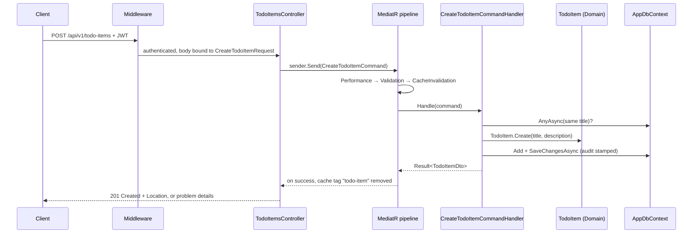

# Architecture guide

This guide explains how the template works, using its own code. Read it once from top to bottom. After that, use it as a reference. Each layer also has a short `GUIDE.md` in its project folder.

The rule files ([RULES-COMPOSE.md](../RULES-COMPOSE.md), [RULES.md](../RULES.md) and the per-layer `RULES.md` files) say what you **must** do. This guide explains **why** the code is shaped that way. If the two ever disagree, the rule files win.

## Contents

1. [The big picture](#1-the-big-picture)
2. [The layers](#2-the-layers)
3. [Dependency injection: how interfaces meet implementations](#3-dependency-injection-how-interfaces-meet-implementations)
4. [One request, end to end](#4-one-request-end-to-end)
5. [Core concepts](#5-core-concepts)
6. [Supporting capabilities](#6-supporting-capabilities)
7. [Choosing what to use](#7-choosing-what-to-use)
8. [Deliberate tradeoffs](#8-deliberate-tradeoffs)
9. [Learning path](#9-learning-path)

---

## 1. The big picture

The solution has five source projects and six test projects:

| Project | One-line job |
|---|---|
| [TemplateApp.Domain](../src/TemplateApp.Domain/GUIDE.md) | Business objects and their rules. No frameworks. |
| [TemplateApp.Application](../src/TemplateApp.Application/GUIDE.md) | Use cases: one command or query per operation, plus the interfaces they need. |
| [TemplateApp.Contracts](../src/TemplateApp.Contracts/GUIDE.md) | Shapes of HTTP request bodies and query strings. |
| [TemplateApp.Infrastructure](../src/TemplateApp.Infrastructure/GUIDE.md) | SQL Server through EF Core, migrations, caching, health checks. |
| [TemplateApp.Api](../src/TemplateApp.Api/GUIDE.md) | Controllers, middleware, authentication, OpenAPI, and the startup code that wires everything together. |

The sample feature is **TodoItems**. It exists to show every convention working, and you delete it when your own feature is in place (see the README section "Removing the sample feature").

### Compile-time dependencies

A **compile-time dependency** is a `<ProjectReference>` in a `.csproj` file. It decides which types a project can see.

```
Api ──► Application ──► Domain
 │  └─► Contracts
 └────► Infrastructure ──► Application
```

| Project | References | Why |
|---|---|---|
| Domain | nothing | Business rules must not depend on databases, web or libraries. |
| Contracts | nothing | Request shapes can be shared with clients without pulling in the server. |
| Application | Domain | Use cases work with entities and `Result<T>`. Also the `Microsoft.EntityFrameworkCore` package (see [tradeoffs](#8-deliberate-tradeoffs)). |
| Infrastructure | Application | It implements interfaces that Application declares (`IAppDbContext`, `ICacheService`). |
| Api | Application, Contracts, Infrastructure | Controllers send Application requests built from Contracts. Infrastructure is referenced **only** so `Program.cs` can register it. |

The arrows point inwards. The Domain knows nothing about the outer layers. These rules are tested on every build by [LayerDependencyTests.cs](../tests/TemplateApp.ArchitectureTests/LayerDependencyTests.cs).

### Runtime request flow

The **runtime flow** is the order in which code runs for a request. It is different from the compile-time graph. At runtime, Application code calls Infrastructure code (for example, `AppDbContext.SaveChangesAsync`), even though Application has no reference to Infrastructure. That works through interfaces and dependency injection (section 3).

```
HTTP → middleware → Controller (Api) → MediatR pipeline (Application)
     → Handler (Application) → Domain entity + IAppDbContext (implemented in Infrastructure)
     → Result<T> → Controller → HTTP response
```

---

## 2. The layers

This section gives a summary of each layer. The layer `GUIDE.md` files have the folder-by-folder detail.

### Domain

- **Responsibility:** entities and their invariants. An **invariant** is a rule that must always hold, such as "a title is required and at most 200 characters". This layer also holds the domain errors and the `Result<T>` type.
- **Important files:** [TodoItem.cs](../src/TemplateApp.Domain/TodoItems/TodoItem.cs), [TodoItemErrors.cs](../src/TemplateApp.Domain/TodoItems/TodoItemErrors.cs), [Result.cs](../src/TemplateApp.Domain/Common/Results/Result.cs), [AuditableEntity.cs](../src/TemplateApp.Domain/Common/AuditableEntity.cs).
- **Stays outside:** I/O, EF Core, HTTP, logging, the clock, the current user.
- **You edit it** first, when a feature needs a new entity, a new state change or a new error.

### Application

- **Responsibility:** one folder per use case, containing a request (command or query), its handler and its validator. Each feature also has DTOs and mappers. Shared pipeline behaviours and the interfaces the use cases need live in `Common/`.
- **Important files:** [DependencyInjection.cs](../src/TemplateApp.Application/DependencyInjection.cs), [Common/Interfaces](../src/TemplateApp.Application/Common/Interfaces/IAppDbContext.cs), [Common/Behaviours](../src/TemplateApp.Application/Common/Behaviours/ValidationBehaviour.cs), [Features/TodoItems](../src/TemplateApp.Application/Features/TodoItems/TodoItemCache.cs).
- **Stays outside:** SQL Server specifics, Redis, HTTP status codes, controllers, configuration reading.
- **You edit it** for every new operation.

### Contracts

- **Responsibility:** the JSON bodies and query-string objects that clients send.
- **Important files:** [CreateTodoItemRequest.cs](../src/TemplateApp.Contracts/Requests/TodoItems/CreateTodoItemRequest.cs), [PageRequest.cs](../src/TemplateApp.Contracts/Common/PageRequest.cs).
- **Stays outside:** validation rules, logic, references to any other project.
- **You edit it** when a new endpoint accepts a body or new query parameters.

### Infrastructure

- **Responsibility:** the real implementations of database and cache access, plus EF Core configuration, migrations, interceptors, health checks and option classes.
- **Important files:** [DependencyInjection.cs](../src/TemplateApp.Infrastructure/DependencyInjection.cs), [AppDbContext.cs](../src/TemplateApp.Infrastructure/Data/AppDbContext.cs), [TodoItemConfiguration.cs](../src/TemplateApp.Infrastructure/Data/Configurations/TodoItemConfiguration.cs), [HybridCacheService.cs](../src/TemplateApp.Infrastructure/Caching/HybridCacheService.cs).
- **Stays outside:** business rules, use cases, controllers.
- **You edit it** when you add an entity: a `DbSet`, an entity configuration and a migration.

### Api

- **Responsibility:** HTTP. This means routing, authentication, turning requests into commands and queries, turning `Result<T>` into responses, middleware, OpenAPI and health endpoints. It is also the **composition root**, the one place where all layers are registered.
- **Important files:** [Program.cs](../src/TemplateApp.Api/Program.cs), [DependencyInjection.cs](../src/TemplateApp.Api/DependencyInjection.cs), [ApiController.cs](../src/TemplateApp.Api/Controllers/ApiController.cs), [TodoItemsController.cs](../src/TemplateApp.Api/Controllers/TodoItemsController.cs).
- **Stays outside:** business rules and data access. Controllers must not use `IAppDbContext` or EF Core (an architecture test checks this).
- **You edit it** to add one controller action per new use case.

---

## 3. Dependency injection: how interfaces meet implementations

**Dependency injection (DI)** means a class asks for what it needs in its constructor, and the framework supplies it. The class depends on an interface. Startup code decides which implementation is used.

[Program.cs](../src/TemplateApp.Api/Program.cs) calls three registration methods, one per layer:

```csharp
builder.Services
    .AddPresentation()                          // Api/DependencyInjection.cs
    .AddApplication()                           // Application/DependencyInjection.cs
    .AddInfrastructure(builder.Configuration);  // Infrastructure/DependencyInjection.cs
```

| Interface (declared in Application) | Implementation | Registered in |
|---|---|---|
| `IAppDbContext` | `AppDbContext` (Infrastructure) | `AddInfrastructure` → `AddPersistence` |
| `ICacheService` | `HybridCacheService` (Infrastructure) | `AddInfrastructure` → `AddCaching` |
| `IUser` | `CurrentUser` (Api, reads the JWT `sub` claim) | `AddPresentation` → `AddIdentityInfrastructure` |
| `TimeProvider` (.NET type) | `TimeProvider.System` | `AddInfrastructure` |

`AddApplication` scans the Application assembly. It registers every handler and every FluentValidation validator automatically, and adds the three pipeline behaviours in order. You never register a new handler by hand.

So a handler such as `CreateTodoItemCommandHandler(IAppDbContext context, ...)` compiles against the interface only. At runtime it receives the `AppDbContext` instance that Infrastructure registered.

---

## 4. One request, end to end

The use case traced here is **Create a todo item**: `POST /api/v1/todo-items`.



**Step by step:**

1. **Middleware** ([UseCoreMiddlewares](../src/TemplateApp.Api/DependencyInjection.cs)) runs in this order:
   - `RequestLogContextMiddleware` assigns a correlation id;
   - Serilog request logging;
   - the exception handler and status code pages;
   - authentication;
   - authorization.

   The controller has `[Authorize]`, so a request with no valid token stops here with 401.
2. **Controller.** [`TodoItemsController.Create`](../src/TemplateApp.Api/Controllers/TodoItemsController.cs) receives a `CreateTodoItemRequest` (Contracts). It builds a `CreateTodoItemCommand` and calls `sender.Send`. `ISender` is MediatR's entry point.
3. **Pipeline.** Behaviours wrap the handler like layers of an onion:
   - [`PerformanceBehaviour`](../src/TemplateApp.Application/Common/Behaviours/PerformanceBehaviour.cs) starts a timer.
   - [`ValidationBehaviour`](../src/TemplateApp.Application/Common/Behaviours/ValidationBehaviour.cs) runs [`CreateTodoItemCommandValidator`](../src/TemplateApp.Application/Features/TodoItems/Commands/CreateTodoItem/CreateTodoItemCommandValidator.cs). If the title is empty, it returns a failed `Result` and the handler never runs.
   - [`CacheInvalidationBehaviour`](../src/TemplateApp.Application/Common/Behaviours/CacheInvalidationBehaviour.cs) calls the handler and waits for its result.
4. **Handler.** [`CreateTodoItemCommandHandler`](../src/TemplateApp.Application/Features/TodoItems/Commands/CreateTodoItem/CreateTodoItemCommandHandler.cs):
   - checks for a duplicate title;
   - asks the Domain to create the entity (`TodoItem.Create` enforces the invariants);
   - adds the entity and saves.
5. **Persistence.** During `SaveChangesAsync`, [`AuditableEntityInterceptor`](../src/TemplateApp.Infrastructure/Data/Interceptors/AuditableEntityInterceptor.cs) stamps `CreatedAtUtc` and `CreatedBy`. If two requests race past the duplicate check, the unique index on `Title` fails the insert. [`AppDbContext`](../src/TemplateApp.Infrastructure/Data/AppDbContext.cs) translates the SQL error into `UniqueConstraintViolationException`, and the handler returns `TodoItemErrors.DuplicateTitle`.
6. **Result.** The handler returns `createResult.Value.ToDto()`. An implicit conversion turns the DTO into a successful `Result<TodoItemDto>`. On the way back out, `CacheInvalidationBehaviour` sees success and removes the `todo-item` cache tag, and `PerformanceBehaviour` logs a warning if the request took longer than 500 ms.
7. **HTTP response.** The controller calls `result.Match(...)`:
   - **Success:** `201 Created` with a `Location` header that points to `GetTodoItemById`.
   - **Failure:** `Problem(errors)` returns 400 with field errors, or 409 with `"code": "TodoItem.DuplicateTitle"`. Every problem body also carries `traceId` and `correlationId`.
8. **Unexpected exceptions.** Bugs and outages are not part of the Result flow. [`GlobalExceptionHandler`](../src/TemplateApp.Api/Infrastructure/GlobalExceptionHandler.cs) turns them into a 500 response with no internal details, and logs the full exception.

**The handler, annotated:**

```csharp
public async Task<Result<TodoItemDto>> Handle(CreateTodoItemCommand command, CancellationToken ct)
{
    var title = command.Title.Trim();

    if (await context.TodoItems.AnyAsync(item => item.Title == title, ct))   // IAppDbContext: EF Core query
    {
        return TodoItemErrors.DuplicateTitle;                                // Error → failed Result (409)
    }

    var createResult = TodoItem.Create(command.Title, command.Description);  // Domain enforces invariants

    if (createResult.IsError)
    {
        return Result.Failure<TodoItemDto>(createResult.Errors);             // pass domain errors through
    }

    context.TodoItems.Add(createResult.Value);

    try
    {
        await context.SaveChangesAsync(ct);                                  // interceptor stamps audit columns
    }
    catch (UniqueConstraintViolationException)                               // race on the unique index
    {
        return TodoItemErrors.DuplicateTitle;
    }

    logger.LogInformation("Todo item created. Id: {TodoItemId}", createResult.Value.Id);  // log ids, not objects

    return createResult.Value.ToDto();                                       // DTO → successful Result
}
```

---

## 5. Core concepts

These are the architectural foundations. Every feature uses them, and removing one means restructuring the template.

### Result pattern and centralized HTTP error mapping

- **What:** an operation returns `Result<T>`, which holds either a value or a list of `Error(Code, Description, Kind)`. `ErrorKind` is one of: Validation, NotFound, Conflict, Failure, Unauthorized, Forbidden, Unexpected.
- **Why:** expected failures, such as "not found" or "duplicate", are normal outcomes, not exceptions. Making them return values means the compiler forces callers to handle them, and exceptions stay reserved for real bugs and outages.
- **Where:** [Result.cs](../src/TemplateApp.Domain/Common/Results/Result.cs), [Error.cs](../src/TemplateApp.Domain/Common/Results/Error.cs) and [ErrorKind.cs](../src/TemplateApp.Domain/Common/Results/ErrorKind.cs). The only mapping to HTTP is [`ApiController.Problem`](../src/TemplateApp.Api/Controllers/ApiController.cs):

  | ErrorKind | Status |
  |---|---|
  | Validation | 400 |
  | Unauthorized | 401 |
  | Forbidden | 403 |
  | NotFound | 404 |
  | Conflict | 409 |
  | Failure | 422 |
  | other | 500 |

- **In a request:** the Domain or a handler returns an `Error`, the validation behaviour builds one from validator failures, and the controller's `Match(..., Problem)` turns it into an RFC 9457 **problem details** body (a standard JSON error format).
- **Kind:** foundation.

Two small interfaces support this. [`IErrorResultFactory`](../src/TemplateApp.Domain/Common/Results/Abstractions/IErrorResultFactory.cs) lets `ValidationBehaviour` build a failed `Result<T>` without knowing `T`. [`IOperationResult`](../src/TemplateApp.Domain/Common/Results/Abstractions/IOperationResult.cs) lets `CacheInvalidationBehaviour` check `IsSuccess`.

### CQRS: commands, queries, handlers and pipeline behaviours

- **What:** **CQRS** (Command Query Responsibility Segregation) separates operations that change state (**commands**) from operations that only read (**queries**). Each request has exactly one **handler**. **MediatR** is the library that finds the handler for a request. **Pipeline behaviours** are classes that run around every handler, like middleware for use cases.
- **Why:** reads and writes have different needs. Reads use `AsNoTracking`, projection and caching. Writes use domain rules and cache invalidation. Behaviours keep cross-cutting work (validation, timing, invalidation) out of every handler.
- **Where:**
  - [ICommand.cs](../src/TemplateApp.Application/Common/Interfaces/ICommand.cs) and [IQuery.cs](../src/TemplateApp.Application/Common/Interfaces/IQuery.cs). Both return `Result<T>`.
  - The behaviours are registered in [Application DependencyInjection.cs](../src/TemplateApp.Application/DependencyInjection.cs). Registration order is execution order: `PerformanceBehaviour` → `ValidationBehaviour` → `CacheInvalidationBehaviour` → handler.
- **In a request:** see steps 3 to 6 of the trace above.
- **Kind:** foundation.

### Vertical slicing and self-contained use cases

- **What:** code is grouped by feature and use case, not by technical type. Everything for "create a todo item" sits in one folder:

  ```
  Features/TodoItems/Commands/CreateTodoItem/
      CreateTodoItemCommand.cs
      CreateTodoItemCommandHandler.cs
      CreateTodoItemCommandValidator.cs
  ```

- **Why:** when you change one operation, you open one folder. Use cases do not call each other's handlers, so changing one cannot silently break another.
- **Where:** [Features/TodoItems](../src/TemplateApp.Application/Features/TodoItems/TodoItemCache.cs). [ConventionTests.cs](../tests/TemplateApp.ArchitectureTests/ConventionTests.cs) enforces the folder shape, one sealed handler per request, and a validator next to its request.
- **In a request:** MediatR routes `CreateTodoItemCommand` to the handler in the same folder.
- **Kind:** foundation.

### Feature organization: one use case per application operation

A **use case** is something a client can ask the application to do: create, update, delete, get one, list. Each one gets a command or query folder, and usually one controller action.

Helpers are **not** use cases. Do not create a handler for "normalize a title" or "check whether a title exists". Put that logic where it belongs:

- **business rules** go in the entity. For example, `TodoItem.Validate` and `Normalize` are private methods of [TodoItem.cs](../src/TemplateApp.Domain/TodoItems/TodoItem.cs);
- **queries** go inside the handler that needs them. For example, the duplicate check is in `CreateTodoItemCommandHandler`;
- **mapping** goes in the feature mapper ([TodoItemMapper.cs](../src/TemplateApp.Application/Features/TodoItems/Mappers/TodoItemMapper.cs));
- **constants shared by one feature** go in a feature class ([TodoItemCache.cs](../src/TemplateApp.Application/Features/TodoItems/TodoItemCache.cs)).

The feature folder holds `Commands/`, `Queries/`, `Dtos/`, `Mappers/` and small shared files such as `TodoItemCache.cs`.

---

## 6. Supporting capabilities

These are built around the core. Some can be switched off by configuration; section 7 shows which and how.

### Serilog and Seq

- **What:**
  - **Serilog** is the logging library inside the app. It writes **structured** events: each value, such as `{TodoItemId}`, is stored as a separate field instead of being baked into the message text.
  - **Seq** is a separate server that receives those events and lets you search them in a web UI.

  In short, Serilog produces logs and Seq stores and searches them.
- **Why:** structured logs let you filter all events for one request with `CorrelationId = '...'` instead of searching text.
- **Where:**
  - Configuration is the `Serilog` section in [appsettings.json](../src/TemplateApp.Api/appsettings.json). The Seq sink (a **sink** is a log destination) is added in [appsettings.Development.json](../src/TemplateApp.Api/appsettings.Development.json) and, in Docker, by environment variables in [docker-compose.yml](../docker-compose.yml).
  - [RequestLogContextMiddleware.cs](../src/TemplateApp.Api/Infrastructure/RequestLogContextMiddleware.cs) adds `CorrelationId` to every event.
- **In a request:**
  - one request summary event (path only, no query string or body);
  - handler events such as "Todo item created";
  - a slow-request warning from `PerformanceBehaviour`.
- **Kind:** Serilog is a foundation. Console output is always on. Seq is optional.

### Docker

- **Image:** a packaged, read-only filesystem containing the app and its runtime. Built by the [Dockerfile](../Dockerfile) in two stages:
  - the SDK image restores and publishes;
  - the result is copied onto the smaller `aspnet` runtime image and runs as a non-root user on port 8080.
- **Container:** a running instance of an image.
- **Compose:** a file that describes several containers and starts them together. [docker-compose.yml](../docker-compose.yml) defines:
  - `api`;
  - `migrator`: the same image run with `--migrate`. `api` waits for it to finish successfully;
  - `db`: SQL Server;
  - `redis`: only with the `cache` profile;
  - `seq`: only with the `logging` profile.
- **Network:** Compose puts the services on one private network, where they reach each other by service name (`Server=db,1433`, `redis:6379`, `http://seq:5341`). No custom network is declared; the default one is used.
- **Volume:** storage that survives container restarts. `db-data` keeps the database, and `seq-data` keeps logs. Redis has no volume on purpose, because it is only a cache. `docker compose down -v` deletes the volumes and therefore the data.
- **Kind:** optional for development (you can `dotnet run` against any SQL Server). The integration tests need a running Docker engine, because they use **Testcontainers**, a library that starts throwaway SQL Server and Redis containers. The deployment uses Docker.

### GitHub Actions

GitHub Actions runs **workflows** (YAML files in `.github/workflows`) on GitHub's machines.

- **CI** ([ci.yml](../.github/workflows/ci.yml)) runs on pull requests and on pushes to branches other than `main`. It:
  1. restores;
  2. builds with warnings as errors;
  3. runs the architecture tests first;
  4. runs the full test suite;
  5. uploads the test results;
  6. builds the Docker image without pushing it.
- **Image publishing** ([release.yml](../.github/workflows/release.yml)) runs on every push to `main`. It runs CI, then pushes the image as `sha-<commit>` and `latest`. The default registry is GHCR, using the built-in `GITHUB_TOKEN`.
- **Deployment** ([deploy.yml](../.github/workflows/deploy.yml)) runs only when the repository variable `DEPLOY_ENABLED` is `true`. It connects to one server over SSH, copies the [deploy](../deploy/deploy.sh) files, and runs `deploy.sh`. That script pulls the image, runs migrations, starts the new version, and waits for `/health/ready`.
- **Secrets:**
  - SSH and registry credentials are GitHub secrets on the `production` environment;
  - application secrets (connection strings, token settings) live only in the server's `.env`, never in GitHub.

  The README section "CI/CD" lists every variable and secret.
- **Rollback limits:**
  - `deploy.sh` restores the previous image if the new one never becomes healthy;
  - `rollback.sh` or a manual "Run workflow" can redeploy any earlier tag;
  - database migrations are **never** reverted, so migrations must stay backward compatible;
  - deployment targets one host and has no zero-downtime rolling update.
- **Kind:** CI is a foundation, because it enforces the rules. Publishing runs on every push to `main`. Deployment is optional and off by default.

### Caching

- **What:**
  - **Local cache (L1):** memory inside one API process. Very fast, but each instance has its own copy.
  - **Redis (L2):** a shared in-memory store that every API instance can read.

  Both are run by .NET's **HybridCache**, which checks L1, then L2, then runs the database query.
- **Keys:** a **key** names one cached value. The query declares it, and it must include every parameter that changes the result. In [GetTodoItemByIdQuery.cs](../src/TemplateApp.Application/Features/TodoItems/Queries/GetTodoItemById/GetTodoItemByIdQuery.cs) the key is `todo-item:{id}`. In [GetTodoItemsQuery.cs](../src/TemplateApp.Application/Features/TodoItems/Queries/GetTodoItems/GetTodoItemsQuery.cs) it is `todo-items:page:{n}:size:{m}`.
- **Expiration:**
  - entries expire after `TodoItemCache.Expiration` (5 minutes);
  - in local memory, they also expire after at most `Caching:LocalExpiration` (30 seconds).
- **Invalidation:**
  - commands implement `IInvalidatesCache` and list **tags** (group names such as `todo-item`);
  - after a successful command, `CacheInvalidationBehaviour` removes every entry with that tag;
  - [RedisCacheTagIndex.cs](../src/TemplateApp.Infrastructure/Caching/RedisCacheTagIndex.cs) records which keys belong to each tag in Redis, so invalidation also reaches other instances.
- **Consistency limits:** the cache is **eventually consistent**, which means a read can briefly return an old value.
  - Another instance can serve an old value for up to `Caching:LocalExpiration`.
  - An invalidation that happens while Redis is down leaves entries until they expire.
  - Only immutable DTOs are cached, never EF entities.
- **Failure behaviour:** [HybridCacheService.cs](../src/TemplateApp.Infrastructure/Caching/HybridCacheService.cs) **fails open**: if the cache breaks, reads go to the database and the error is logged as a warning.
- **In a request:** `GetTodoItemByIdQueryHandler` calls `cache.GetOrCreateAsync(query, ...)`, and the database runs only on a miss.
- **Kind:**
  - the in-process cache is always on: queries call `ICacheService` directly;
  - Redis is optional.

### Tests

| Project | Tests | Needs Docker |
|---|---|---|
| [Domain.UnitTests](../tests/TemplateApp.Domain.UnitTests/TodoItems/TodoItemTests.cs) | Entity rules and `Result<T>` behaviour | no |
| [Application.UnitTests](../tests/TemplateApp.Application.UnitTests/Behaviours/PipelineTests.cs) | Handlers and validators per use case, and the real MediatR pipeline. Uses EF Core InMemory through [InMemoryAppDbContext](../tests/TemplateApp.Application.UnitTests/Common/InMemoryAppDbContext.cs) | no |
| [Infrastructure.IntegrationTests](../tests/TemplateApp.Infrastructure.IntegrationTests/Data/PersistenceTests.cs) | Real SQL Server and Redis: migrations match the model, audit stamping, unique index, SQL ordering, cache behaviour across instances | yes |
| [Api.IntegrationTests](../tests/TemplateApp.Api.IntegrationTests/Controllers/TodoItemsControllerTests.cs) | The real API through HTTP, using [WebAppFactory](../tests/TemplateApp.Api.IntegrationTests/Common/WebAppFactory.cs): routes, status codes, problem bodies, auth, health, correlation ids | yes |
| [ArchitectureTests](../tests/TemplateApp.ArchitectureTests/ConventionTests.cs) | Layer dependencies and folder and naming conventions, using NetArchTest | no |
| [Tests.Common](../tests/TemplateApp.Tests.Common/TodoItems/TodoItemFactory.cs) | Not tests. Shared factories that build valid test data | — |

- **Unit tests** check one piece of code in memory.
- **Integration tests** check code together with real external systems.
- **Architecture tests** check the structure of the code itself.

[tests/RULES.md](../tests/RULES.md) says which tests each new use case needs. All three kinds are foundations.

### OpenAPI and its documentation UI

- **What:** **OpenAPI** is a standard JSON description of the API's endpoints, parameters and responses. **Scalar** is a web UI that reads that document and lets you try requests.
- **Why:** clients and testers can discover the API without reading the code. Attributes such as `[ProducesResponseType]` and `[EndpointSummary]` in the controller feed the document.
- **Where:**
  - `AddCustomApiVersioning` in [Api DependencyInjection.cs](../src/TemplateApp.Api/DependencyInjection.cs) produces one document per API version and adds the bearer-token scheme through [BearerSecuritySchemeTransformer.cs](../src/TemplateApp.Api/OpenApi/Transformers/BearerSecuritySchemeTransformer.cs).
  - [Program.cs](../src/TemplateApp.Api/Program.cs) maps `/openapi/v1.json` and `/scalar` only when `OpenApi:Enabled` is true.
- **In a request:** not involved in normal API calls. It only serves the document and the UI.
- **Kind:** optional.

### Central Package Management and shared build settings

- **What:**
  - **Central Package Management (CPM):** every NuGet version is set once in [Directory.Packages.props](../Directory.Packages.props), and `.csproj` files list package names without versions.
  - **Shared build settings:** [Directory.Build.props](../Directory.Build.props) applies the target framework, nullable checks, warnings as errors and StyleCop to every project.
  - [src/Directory.Build.props](../src/Directory.Build.props) adds the banned-API analyzer for production code. It forbids `DateTime.Now`, `.Result`, `.Wait()` and `Console.WriteLine` ([BannedSymbols.txt](../src/BannedSymbols.txt)).
  - [tests/Directory.Build.props](../tests/Directory.Build.props) adds xUnit to every test project.
- **Why:** one version per package across the solution, and the same quality bar everywhere without copy-paste.
- **In a request:** not at runtime. These settings act at build time.
- **Kind:** foundation.

---

## 7. Choosing what to use

### Capability table

| Capability | When you need it | Current default | How to enable or disable | Dependencies and consequences |
|---|---|---|---|---|
| **In-process cache** | Always present | On | No setting. Turning it off requires code changes: remove `ICachedQuery` from queries and the `GetOrCreateAsync` call from their handlers. | On one instance, invalidation is immediate. With several instances and no Redis, another instance can serve old data for up to `Caching:LocalExpiration` (30 s). |
| **Redis (shared cache)** | More than one API instance, or a cache that survives restarts | Off in `appsettings.json` (no connection string). On in `.env.example` | App: `ConnectionStrings:Redis` (empty = off). Compose: `REDIS_CONNECTION_STRING` in `.env`. Server: `ConnectionStrings__Redis` in the server `.env` | Requires Redis 7.0+. If Redis is down, reads still work and `/health/ready` reports `Degraded` with HTTP 200. |
| **Seq** | Searching logs across requests | On in Development and Docker. Off in Production | Development: remove the `WriteTo:Seq` block from `appsettings.Development.json`. Compose: remove `*seq-logging` from the `api` and `migrator` environments in `docker-compose.yml`. Production: add `Serilog__WriteTo__Seq__Name=Seq` and `Serilog__WriteTo__Seq__Args__serverUrl` (see `deploy/server.env.example`) | Console logging is always on. With the sink on but no Seq server, events are dropped after retries. |
| **OpenAPI and Scalar** | Exploring or sharing the API | On in Development, off otherwise | `OpenApi:Enabled` (`true`/`false`) | When off, `/openapi/*` and `/scalar` return 404. The OpenAPI services stay registered. |
| **Docker** | Local stack, integration tests, deployment | Used by Compose, tests and deploy | No switch. Run `dotnet run` against your own SQL Server to avoid it during development | Integration tests and CI cannot run without Docker. |
| **Image publishing** | Every push to `main` | On | No setting. Disable the "Release" workflow in GitHub (Actions → Release → Disable workflow), or edit `release.yml` | Pushes `sha-<commit>` and `latest` to the registry. |
| **Automatic deployment** | Deploying to a server on every push to `main` | Off | Repository variable `DEPLOY_ENABLED=true`, plus the variables and secrets listed in the README section "CI/CD" | Needs a Docker host reachable over SSH, an external SQL Server and a reverse proxy. Migrations are not rolled back. |
| **Migrate on startup** | Local development | On in Development, off otherwise | `Database:InitializeOnStartup` | Deployments use `--migrate` instead, so replicas do not race. |
| **Sample-data seeding** | Demo data in an empty database | On in Development, off otherwise | `Database:SeedSampleData` | Inserts two TodoItems only when the table is empty. Replace or remove it in `ApplicationDbContextInitialiser.SeedAsync` when you delete the sample. |

Settings use the normal ASP.NET Core order, where later sources override earlier ones:

1. `appsettings.json`
2. `appsettings.{Environment}.json`
3. user secrets (Development only)
4. environment variables

In environment variables, `:` is written `__`.

### Stopping a container is not disabling the integration

Docker Compose profiles decide **which containers run**. Application settings decide **what the app tries to use**. These are separate switches:

| You do | Result |
|---|---|
| Remove `cache` from `COMPOSE_PROFILES` and keep `REDIS_CONNECTION_STRING` | No Redis container. The app still tries to reach Redis, logs warnings and falls back to local memory, and readiness reports `Degraded`. |
| Also empty `REDIS_CONNECTION_STRING` | Redis is fully off. The app uses local memory only. |
| Remove `logging` from `COMPOSE_PROFILES` | No Seq container. The app keeps sending to `SEQ_SERVER_URL` because `docker-compose.yml` always sets the Seq sink, and those events are dropped. |
| Also remove `*seq-logging` from `docker-compose.yml` | The Seq sink is off. Console logging only. |

---

## 8. Deliberate tradeoffs

- **EF Core is exposed through `IAppDbContext`.** [IAppDbContext.cs](../src/TemplateApp.Application/Common/Interfaces/IAppDbContext.cs) exposes `DbSet<TodoItem>`. As a result:
  - Application references the `Microsoft.EntityFrameworkCore` package (not the SQL Server provider);
  - handlers write LINQ queries directly, with no repository classes. This means less code, and queries stay next to the use case that needs them;
  - the cost is that Application is tied to EF Core, and unit tests use the InMemory provider, which does not behave exactly like SQL Server. Behaviour that is specific to SQL Server is therefore tested in `Infrastructure.IntegrationTests`.

  The rules ask you to keep this approach unless you decide otherwise on purpose.
- **Controllers, not minimal APIs.** Controllers give a base class, `ApiController`, for the single error mapping.
- **MediatR is pinned at 12.5.0**, the last Apache-2.0 release. Later versions need a commercial license.
- **There are no domain events.** Add them deliberately, ideally dispatched after the commit.
- **The cache is eventually consistent,** within the limits explained in section 6.
- **Single-host deployment** over SSH, with no zero-downtime rollout and no schema rollback.
- **No TLS, CORS or rate limiting in the app.** TLS ends at a reverse proxy in front of the API.

The README section "Design decisions and known limitations" has the full list.

---

## 9. Learning path

### Recommended reading order

1. This guide, sections 1 to 4.
2. [RULES.md](../RULES.md), then [RULES-COMPOSE.md](../RULES-COMPOSE.md).
3. Follow the code in request order:
   1. [TodoItemsController.cs](../src/TemplateApp.Api/Controllers/TodoItemsController.cs)
   2. [CreateTodoItemCommandHandler.cs](../src/TemplateApp.Application/Features/TodoItems/Commands/CreateTodoItem/CreateTodoItemCommandHandler.cs)
   3. [TodoItem.cs](../src/TemplateApp.Domain/TodoItems/TodoItem.cs)
   4. [AppDbContext.cs](../src/TemplateApp.Infrastructure/Data/AppDbContext.cs)
4. Each layer's `GUIDE.md`, then its `RULES.md`.
5. The tests for one use case, for example [CreateTodoItemCommandHandlerTests.cs](../tests/TemplateApp.Application.UnitTests/Features/TodoItems/Commands/CreateTodoItem/CreateTodoItemCommandHandlerTests.cs) and [TodoItemsControllerTests.cs](../tests/TemplateApp.Api.IntegrationTests/Controllers/TodoItemsControllerTests.cs).
6. Sections 5 to 8 of this guide, and the README for commands and configuration.

### Starting a new project from the template

- [ ] Generate it: `dotnet new cleanarch-api -n Acme.Orders -o Acme.Orders`. Use a short path on Windows.
- [ ] Run `dotnet build` and `dotnet test`. Docker must be running for the integration tests.
- [ ] Copy `.env.example` to `.env` and set `DB_SA_PASSWORD` and `JWT_SIGNING_KEY`.
- [ ] Set `ConnectionStrings:Database` (and optionally `ConnectionStrings:Redis`) in user secrets, never in `appsettings*.json`.
- [ ] Decide on Redis, Seq and deployment using the [capability table](#capability-table).
- [ ] Add your first feature (next list), then remove TodoItems (README section "Removing the sample feature").
- [ ] Create a fresh `InitialCreate` migration after removing the sample.
- [ ] For deployment, set the GitHub variables and secrets, and create the server `.env` from `deploy/server.env.example`.

### Adding one feature, step by step

The example is a `Projects` feature with `CreateProject` and `GetProjects`. Paths are relative to `src/`.

| # | Step | Where |
|---|---|---|
| 1 | Entity with private setters and `static Result<Project> Create(...)`, plus errors | `TemplateApp.Domain/Projects/Project.cs`, `ProjectErrors.cs` |
| 2 | `DbSet` on the interface and on the context | `Application/Common/Interfaces/IAppDbContext.cs`, `Infrastructure/Data/AppDbContext.cs` |
| 3 | EF configuration: table, lengths, indexes | `Infrastructure/Data/Configurations/ProjectConfiguration.cs` |
| 4 | Migration | `dotnet ef migrations add AddProjects --project src/TemplateApp.Infrastructure --startup-project src/TemplateApp.Api --output-dir Data/Migrations` |
| 5 | DTO and mapper (`Projection` expression + `ToDto()`) | `Application/Features/Projects/Dtos/ProjectDto.cs`, `Mappers/ProjectMapper.cs` |
| 6 | Command (+ `IInvalidatesCache` if any query is cached) | `Application/Features/Projects/Commands/CreateProject/CreateProjectCommand.cs` |
| 7 | Handler | `.../CreateProject/CreateProjectCommandHandler.cs` |
| 8 | Validator | `.../CreateProject/CreateProjectCommandValidator.cs` |
| 9 | Query, handler and validator (+ `ICachedQuery<T>` and `ProjectCache.cs` if cached) | `Application/Features/Projects/Queries/GetProjects/` |
| 10 | Request body | `Contracts/Requests/Projects/CreateProjectRequest.cs` |
| 11 | Controller: sealed, `: ApiController`, `[Authorize]`, one action per use case | `Api/Controllers/ProjectsController.cs` |
| 12 | Tests: domain, handler, validator, endpoint success and failure, factory | `tests/` (see [tests/RULES.md](../tests/RULES.md)) |
| 13 | Verify | `dotnet build`, `dotnet test tests/TemplateApp.ArchitectureTests`, `dotnet test` |

Handlers, validators, controllers and EF configurations are found by assembly scanning, so no registration is needed.

### Where should this code go?

| Code | Location |
|---|---|
| A business rule, such as "cannot complete twice" | Entity method in `Domain/<Feature>/` |
| A named error | `Domain/<Feature>/<Entity>Errors.cs` |
| Input checks: required, length, range | `<Request>Validator` next to the request (and the entity, if it is an invariant) |
| A database query | Inside the handler that needs it |
| Table, column or index settings | `Infrastructure/Data/Configurations/<Entity>Configuration.cs` |
| A JSON request body | `Contracts/Requests/<Feature>/` |
| Data returned to clients | `Application/Features/<Feature>/Dtos/` |
| Entity → DTO mapping | `Application/Features/<Feature>/Mappers/` |
| Cache key, tags and lifetime | On the query (`ICachedQuery<T>`), with constants in `<Feature>Cache.cs` |
| Cache invalidation | `IInvalidatesCache` on the command. Never by hand |
| Error → HTTP status | Already in `ApiController.Problem`. Do not add another mapping |
| A new external service | Interface in `Application/Common/Interfaces`, implementation and registration in Infrastructure |
| A new setting | Option class in `Infrastructure/Settings`, bound in `AddInfrastructure` |
| Middleware, auth, OpenAPI | `Api/DependencyInjection.cs` and `Api/Infrastructure/` |
| Test data builders | `tests/TemplateApp.Tests.Common/<Feature>/` |

### Directing an AI agent

[CLAUDE.md](../CLAUDE.md) and [AGENTS.md](../AGENTS.md) already tell agents to read [RULES-COMPOSE.md](../RULES-COMPOSE.md) first. Make it explicit in your request anyway:

```text
Read RULES-COMPOSE.md and every rule file it lists for the paths you will change.
Add a <Feature> feature with the use cases <A> and <B>, following RULES.md § 2 in layer order.
Use the existing TodoItems feature as the pattern. Do not add new abstractions or change shared infrastructure.
When done, run dotnet build and dotnet test, and report any check you could not run.
```

Tips:

- Ask for one use case at a time. Review each one before asking for the next.
- Name the feature and the operations, not the files. The rules decide where files go.
- If the agent says a rule conflicts with your request, decide explicitly. The rules tell it to ask.
- The architecture tests and analyzers catch most structural mistakes, so always have it run `dotnet build` and `dotnet test`.
